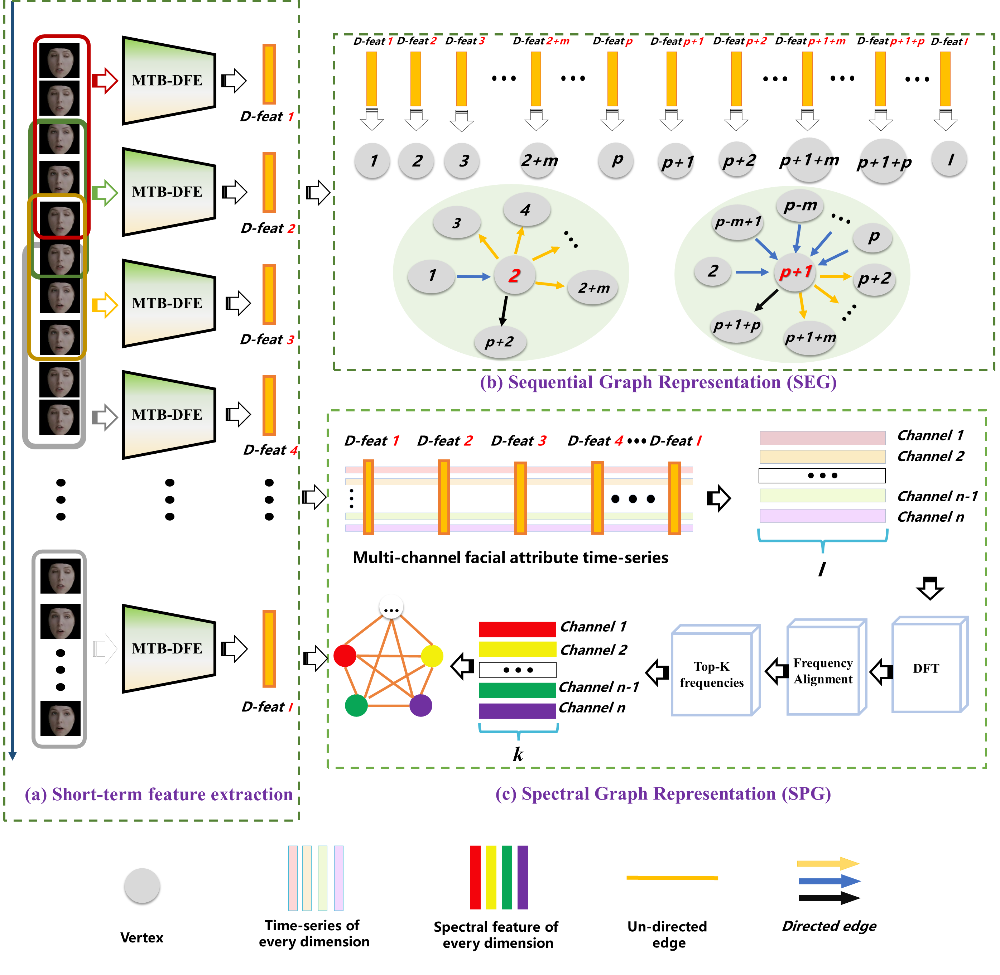

<p align="left">
  
</p>

# Video-based Depression Detection using Graph Representation
[中文](README_ZH.md)   

[English](README.md)

## Introduction
This is the official code repository for the _Two-stage Temporal Modelling Framework for Video-based Depression Recognition using Graph Representation_. For a detailed explanation, refer to our paper: [arXiv:2111.15266](https://arxiv.org/abs/2111.15266).

The project introduces a two-stage model for video-based depression detection:
- **Short-term Depressive Behavior Modeling** using the Multi-scale Temporal Behavioural Feature Extraction-Depression Feature Enhancement (MTB-DFE) model.
- **Video-level Depressive Behavior Modeling** using Spectral Encoding Graph (SEG) and Spectral Propagation Graph (SPG) models.
The models have been tested on the AVEC 2013, AVEC 2014, and AVEC 2019 datasets.

<p align="center">
  
</p>

## Getting Started

### Installation

#### Clone the repository
```bash
git clone https://github.com/jiaqi-pro/Depression-detection-Graph.git
pip install -r requirements.txt
```

### Dataset
#### Download the dataset

The project utilizes the AVEC 2013, AVEC 2014, and AVEC 2019 datasets for training and testing.

You need to contact the authors to gain access to the datasets.

#### Data Preprocessing

_No face extraction step is needed for the AVEC 2019 dataset as it provides feature files._

1. Use [OpenFace 2.0](https://github.com/TadasBaltrusaitis/OpenFace) with the CE-CLM extractor to obtain face images resized to 224x224.
   Directory structure:
```
 ${DATASET_ROOT_FOLDER}
└───path_to_dataset
    └───train
        └───subject_id
            └───frame_det_00_000001.bmp
            └───frame_det_00_000002.bmp
```

2. For all datasets, adjust the length of selected videos to multiples of 30 to ensure a uniform distribution of samples. Each group of 30 frames corresponds to a depression level, saved as a text file, formatted as follows:

```
./Training_face/203_1_cut_combined_aligned/frame_det_00_000001.bmp,./Training_face/203_1_cut_combined_aligned/frame_det_00_000002.bmp,./Training_face/203_1_cut_combined_aligned/frame_det_00_000003.bmp,./Training_face/203_1_cut_combined_aligned/frame_det_00_000004.bmp,./Training_face/203_1_cut_combined_aligned/frame_det_00_000005.bmp,./Training_face/203_1_cut_combined_aligned/frame_det_00_000006.bmp,./Training_face/203_1_cut_combined_aligned/frame_det_00_000007.bmp,./Training_face/203_1_cut_combined_aligned/frame_det_00_000008.bmp,./Training_face/203_1_cut_combined_aligned/frame_det_00_000009.bmp,./Training_face/203_1_cut_combined_aligned/frame_det_00_000010.bmp,./Training_face/203_1_cut_combined_aligned/frame_det_00_000011.bmp,./Training_face/203_1_cut_combined_aligned/frame_det_00_000012.bmp,./Training_face/203_1_cut_combined_aligned/frame_det_00_000013.bmp,./Training_face/203_1_cut_combined_aligned/frame_det_00_000014.bmp,./Training_face/203_1_cut_combined_aligned/frame_det_00_000015.bmp,./Training_face/203_1_cut_combined_aligned/frame_det_00_000016.bmp,./Training_face/203_1_cut_combined_aligned/frame_det_00_000017.bmp,./Training_face/203_1_cut_combined_aligned/frame_det_00_000018.bmp,./Training_face/203_1_cut_combined_aligned/frame_det_00_000019.bmp,./Training_face/203_1_cut_combined_aligned/frame_det_00_000020.bmp,./Training_face/203_1_cut_combined_aligned/frame_det_00_000021.bmp,./Training_face/203_1_cut_combined_aligned/frame_det_00_000022.bmp,./Training_face/203_1_cut_combined_aligned/frame_det_00_000023.bmp,./Training_face/203_1_cut_combined_aligned/frame_det_00_000024.bmp,./Training_face/203_1_cut_combined_aligned/frame_det_00_000025.bmp,./Training_face/203_1_cut_combined_aligned/frame_det_00_000026.bmp,./Training_face/203_1_cut_combined_aligned/frame_det_00_000027.bmp,./Training_face/203_1_cut_combined_aligned/frame_det_00_000028.bmp,./Training_face/203_1_cut_combined_aligned/frame_det_00_000029.bmp,./Training_face/203_1_cut_combined_aligned/frame_det_00_000030.bmp,3
```

### Training Process Overview

A two-stage training strargtegy is proposed to train the proposed approach. 

#### Stage One: Training the MTB-DFE Model

This stage focuses on training the Multi-scale Temporal Behavioral Feature Extraction - Depression Feature Enhancement (MTB-DFE) model in an end-to-end manner, where mutliple loss functions are jointly utilized. 

Given videos $V_1, V_2, \cdots, V_M$ of varying lengths, we extract $I_1, I_2, \cdots, I_M$ thin slices from these videos ($I_1 \neq I_2 \neq  \cdots \neq  I_M$), where the slices of the $m$-th video $V_m$ ($m = 1, 2, \cdots, M$) are denoted as $(S^m_1, S^m_2, \cdots, S^m_{I_m})$. During training, we employ a batch training method where each batch consists of $N$ slices taken from different videos.


****1. Multi-scale Temporal Behavioural Feature Extraction****

***Feeding a set of thin slices to MTB*:**

Given a set of thin slices $\{S_1, S_2, \cdots, S_N\}$ (coming from videos of different inviduals), the MTB yields a multi-scale ($k$ scales) spatio-temporal behavior feature $f^{n-MTB} = [f^{\text{n-MTB}}_1, f^{\text{n-MTB}}_2, \cdots, f^{\text{n-MTB}}_k]$ for each video slice $S_n$ (where $n = 1, 2, \cdots, N$), where $k$ represents the number of spatial scales and $j$ denotes the dimensionality of the feature describing each scale.

****2. Depression Feature Enhancement****

***MTB Output to MTA:***

Each extracted feature $f_n$ is then processed by the Mutual Temporal Attention (MTA) module. This module enhances features that are strongly associated with depressive status, resulting in a set of weighted feature vectors $f^{n-MTA} = [f^{\text{n-MTA}}_1, f^{\text{n-MTA}}_2, f^{\text{n-MTA}}_3, \cdots, f^{\text{n-MTA}}_k]$, which is then flattened to form the final output vector $F^{\text{MTA}}_n$ that has the shape $[1, J]$, where $J = k \times j$.

Consequently, an auxiliary prediction head is attached to estimate the depression severity $p_n^{\text{MTA}}$ from the obtained $F_n^{\text{MTA}}$, allowing the MTB and MTA modules to be supervised by intermediate loss $L_{\text{MTA}}$ as:

  **Calculate the MTA Loss Function $L_{MTA}$:**
  
   $$L_{\text{MTA}} = \frac{1}{N} \sum_{n=1}^{N} \left(p_n^{\text{MTA}}-g_n\right)^{2}$$
    
where $g_n$ represents the ground-truth depression severity corresponding to the input video slice $S_n$.


***MTA Output to NS*:** 

The features $F^{\text{MTA}}_n$ ($n = 1, \cdots, N$) extracted from MTA are then fed to the **Noise Separation (NS)** module, which further extract noise-free depression features $F_n^\text{Dep}$ ($n = 1, \cdots, N$) and their disentangled noise representations $F_n^\text{Non}$ ($n = 1, \cdots, N$). Based on these noise-free depression features and noise representations, the NS module also reconstructs the input features $F^\text{MTA}_n$ ($n = 1, \cdots, N$), denoted as $F_n^\text{Dec}$. Meanwhile, the depression-related features $\{F_1^\text{Dep}, F_2^\text{Dep}, \cdots, F_N^\text{Dep}\}$ are utilized to predict depression severities $\{p^\text{NS}_1, p^\text{NS}_2 , \cdots, p^\text{NS}_N\}$ for their corresponding video slices. 

**Calculate the NS Loss Function $L_{NS}$**

Consequently, the loss $L_{NS}$ is employed to compare the predictions $\{p^\text{NS}_1, p^\text{NS}_2 , \cdots, p^\text{NS}_N\}$ with their corresponding ground-truth depression severity as:

$$L_{\text{NS}} = \frac{1}{N} \sum_{n=1}^{N} \left(p_n^{\text{NS}}-g_n\right)^{2}$$


**Calculate Similarity Function $L_{sim}$**

Then, the loss $L_{sim}$ is utilized to enforce the extracted depression features to be highly correlated with their corresponding depression status. This is achieved by enforncing the depression features extracted from thin slices corresponding to the same depression score to be similar as:

$$L_{\text{sim}} = \frac{1}{N^2}\sum_{n=1}^{N-1} \sum_{i=n+1}^n (F_{n}^\text{Dep}-F_{i}^\text{Dep})^2$$

where $F_{n}^\text{Dep}$ and $F_{i}^\text{Dep}$ are depression-related features extracted from the shared depression encoder, while $n$ and $i$ are the indices of video slices that represent subjects of the same depression score.


**Calculate Dissimilarity Loss Function $L_{D-sim}$**

Next, the loss $L_{D-sim}$ is employed to encourage depression-related and non-depression feature components extracted from the same clip to be orthogonal (dissimilar) as:

$$L_{\text{D-sim}} = \frac{1}{N^2} \sum_{n=1}^{N} \left\|(F_{n}^{\text{Dep}})^{\top} F_{n}^{\text{Non}} \right\|_{\text{Frob}}^{2}$$

where $F_{n}^{\text{Dep}}$ is the depression-related feature and $F_{n}^{\text{Non}}$ is the non-depression-related noise for the $n$-th video slice. $\left\| \cdot \right \| ^{2}_{\text{Frob}}$ represents the squared Frobenius norm.


**Calculate Reconstruction Loss Function $L_{Rec}$**

Furthermore, the loss $L_{Rec}$ is utilized to ensure that the input of the NS moudle can be reconstructed from the extracted depression-related and non-depression feature components using the decoder as:

$$L_{\text{Rec}} = \frac{1}{N \times J} \sum_{n=1}^{N} \sum_{j=1}^{J} \left(F_n^{\text{Dec}}(j) - F_n(j)\right)^{2}$$

where $F_n(j)$ and $F_n^{\text{Dec}}(j)$ are the $j$-th element of the $n$-th input feature and the $j$-th element of the corresponding reconstructed feature generated by the decoder.


**Calculate the MTB-DFE  Loss Function $L_{short}$**

As a result, the final loss function for optimizing the MTB-DFE module can be defined as the $L_{short}$, which is the combination of the above loss functions $L_{MTA}$, $L_{NS}$, $L_{sim}$, $L_{D-sim}$, and $L_{Rec}$ as:

$$L_{\text{short}} =  L_{\text{NS}} + W_1 \times L_{\text{MTA}} + W_2 \times L_{\text{sim}} + W_3 \times L_{\text{D-sim}} + W_4 \times L_{\text{Rec}}$$

where $W_1$, $W_2$, $W_3$ and $W_4$ are weights indicating the importance of each loss component. Here, we set all of them as 1.


<p align="center">
  
</p>


#### Stage Two: Training the SEG / SPG Models

****1. SEG (Sequential Graph Representation)****	

***Extract Depression-Related Features:***

We first apply the well-trained MTB-DFE model to extract depression-related features from the thin slices of the $m$-th video $V_m$ ($m = 1, 2, \cdots, M$), denoted as $(S^m_1, S^m_2, \cdots, S^m_{I_m})$, yielding the corresponding depression-related features $\{F_{1}^{m-Dep}, F_{2}^{m-Dep}, \cdots, F_{I_m}^{m-Dep}\}$.

***Predict Depression Severity:***

The depression-related features  $\{F_{1}^{m-Dep}, F_{2}^{m-Dep}, \cdots, F_{I_m}^{m-Dep}\}$ extracted from the thin slices of the $m$-th video $V_m$ are then fed into the **SEG** module to make the video-level depression predition $p^{SEG}_m$. 

**Calculate the Prediction Loss Function for **SEG**, $L_{SEG}$:**

Consequently, the loss function $L_{SEG}$ is utilized to train the SEG module by comparing the predictions $\{p^{SEG}_1, p^{SEG}_2, \cdots, p^{SEG}_M\}$ of the videos $\{V_1, V_2, \cdots, V_M\}$ with their corresponding ground-truth depression severity $\{g_1, g_2, \cdots, g_M\}$ as:

$$
L_{\text{SEG}} = \frac{1}{M} \sum_{m=1}^{M} \left(p_m^{\text{SEG}}-g_m\right)^{2}
$$


****2. SPG (Spectral Graph Representation)****

***Extract Depression-Related Features:***

The same processing as SEG's ***Extract Depression-Related Features*** is applied.

***Generate the Spectral Feature:***

The depression-related thin slice-level features $\{F_{1}^{m-Dep}, F_{2}^{m-Dep}, \cdots, F_{I_m}^{m-Dep}\}$ of the $m$-th video $V_m$ are processed through `SpectralRepresentation.mlx` to obtain the spectral signal sequence $\{B_1^{m-Dep}, B_2^{m-Dep}, \cdots, B_J^{m-Dep}\}$, where $J$ represents facial attributes and is the same for all videos, while the dimension of $B_j^{m-Dep}$ ($j = 1, 2, \cdots, J$) is $K$, denoting the number of low-frequency components.

***Predict Depression Severity:***

The spectral signals $\{B_1^{m-Dep}, B_2^{m-Dep}, \cdots, B_J^{m-Dep}\}$ of the $m$-th video are input into the **SPG** model to predict the depression severity $p_m^{SPG}$.

**Calculate the Prediction Loss Function for SPG, $L_{SPG}$:**

Consequently, the loss function $L_{SPG}$ is utilized to to train the SPG module by comparing the predictions $\{p^{SPG}_1, p^{SPG}_2, \cdots, p^{SPG}_M\}$ 

of the videos $\{V_1, V_2, \cdots, V_M\}$ with their corresponding ground-truth depression severity $\{g_1, g_2, \cdots, g_M\}$ as

$$
L_{\text{SPG}} = \frac{1}{M} \sum_{m=1}^{M} \left(p_m^{\text{SPG}} - g_m\right)^{2}
$$

where $p_m^{\text{SPG}}$ represents the predicted depression severity for the $m$-th video, and $g_m$ denotes the ground-truth depression severity for the $m$-th video.


## Weight Downloads

Model weights and preprocessed features can be accessed via the following links:
- Baidu Cloud: [Link: https://pan.baidu.com/s/1woEGqgiaCVRepMkWOUIk9Q?pwd=5h2n Code: 5h2n]
- Google Drive: [https://drive.google.com/drive/folders/1JOvTZcVl7EXJnCkhrdAS1dRiN52HD1kj?usp=sharing]

## Considerations

Please adhere to the terms of use for the datasets and refer to the detailed guidelines to ensure the replicability and ethical conduct of the research.

## Future Work

- [ ] Convert **Spectral Representation** to a Python version.
- [ ] Provide **Inference.py**, which takes a video file and predicts the depression level directly.
- [ ] Design a GUI interface or an executable program for easier use.

## Citations and Acknowledgments

This project builds on the following research and acknowledges their contributions:
1. Valstar M, Schuller B, Smith K, et al. Avec 2013: the continuous audio/visual emotion and depression recognition challenge[C]. 2013.
2. Valstar M, Schuller B, Smith K, et al. Avec 2014: 3d dimensional affect and depression recognition challenge[C]. 2014.
3. Ringeval F, Schuller B, Valstar M, et al. AVEC 2019 workshop and challenge: state-of-mind, detecting depression with AI, and cross-cultural affect recognition[C]. 2019.
4. Song S, Jaiswal S, Shen L, et al. Spectral representation of behaviour primitives for depression analysis[J]. IEEE Transactions on Affective Computing, 2020.
