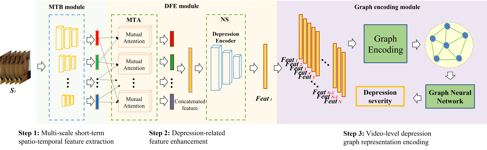
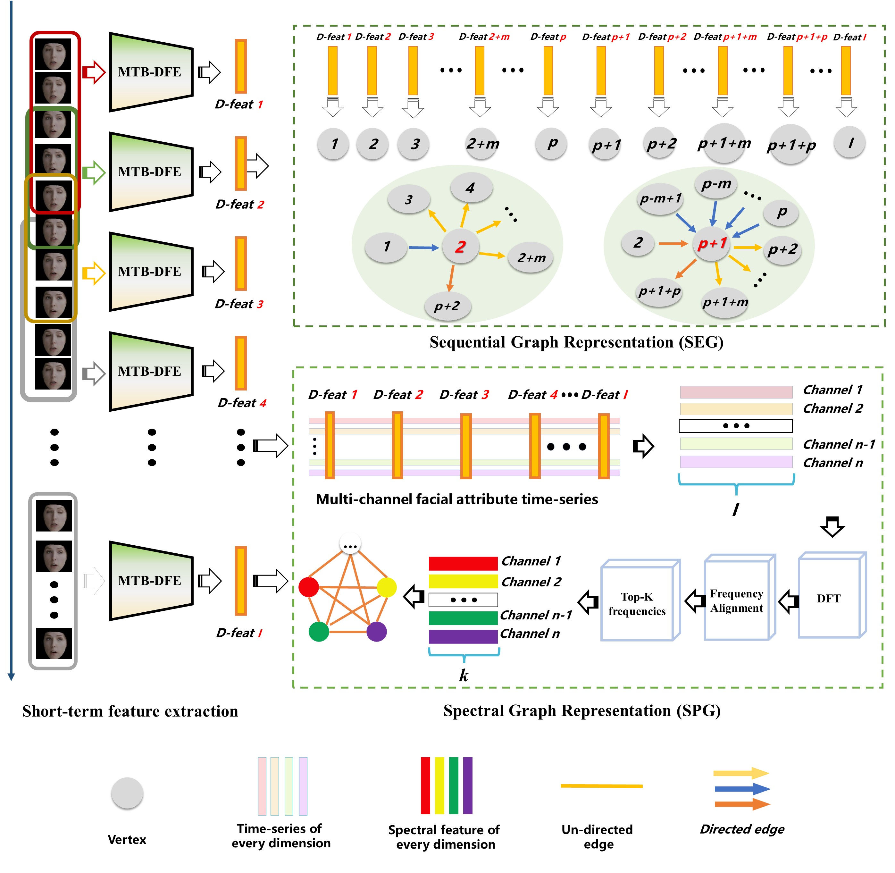

<p align="left">
  
</p>

# Video-based Depression Detection using Graph Representation
[中文](README_ZH.md)   

[English](README.md)

## Introduction
This is the official code repository for the _Two-stage Temporal Modelling Framework for Video-based Depression Recognition using Graph Representation_. For a detailed explanation, refer to our paper: [arXiv:2111.15266](https://arxiv.org/abs/2111.15266).

The project introduces a two-stage model for video-based depression detection:
- **Short-term Depressive Behavior Modeling** using the Multi-scale Temporal Behavioural Feature Extraction-Depression Feature Enhancement (MTB-DFE) model.
- **Video-level Depressive Behavior Modeling** using Spectral Encoding Graph (SEG) and Spectral Propagation Graph (SPG) models.
The models have been tested on the AVEC 2013, AVEC 2014, and AVEC 2019 datasets.

<p align="center">
  
</p>

## Getting Started

### Installation

#### Clone the repository
```bash
git clone https://github.com/jiaqi-pro/Depression-detection-Graph.git
pip install -r requirements.txt
```

### Dataset
#### Download the dataset

The project utilizes the AVEC 2013, AVEC 2014, and AVEC 2019 datasets for training and testing.

You need to contact the authors to gain access to the datasets.

#### Data Preprocessing

_No face extraction step is needed for the AVEC 2019 dataset as it provides feature files._

1. Use [OpenFace 2.0](https://github.com/TadasBaltrusaitis/OpenFace) with the CE-CLM extractor to obtain face images resized to 224x224.
   Directory structure:
```
 ${DATASET_ROOT_FOLDER}
└───path_to_dataset
    └───train
        └───subject_id
            └───frame_det_00_000001.bmp
            └───frame_det_00_000002.bmp
```

2. For all datasets, adjust the length of selected videos to multiples of 30 to ensure a uniform distribution of samples. Each group of 30 frames corresponds to a depression level, saved as a text file, formatted as follows:

```
./Training_face/203_1_cut_combined_aligned/frame_det_00_000001.bmp,./Training_face/203_1_cut_combined_aligned/frame_det_00_000002.bmp,./Training_face/203_1_cut_combined_aligned/frame_det_00_000003.bmp,./Training_face/203_1_cut_combined_aligned/frame_det_00_000004.bmp,./Training_face/203_1_cut_combined_aligned/frame_det_00_000005.bmp,./Training_face/203_1_cut_combined_aligned/frame_det_00_000006.bmp,./Training_face/203_1_cut_combined_aligned/frame_det_00_000007.bmp,./Training_face/203_1_cut_combined_aligned/frame_det_00_000008.bmp,./Training_face/203_1_cut_combined_aligned/frame_det_00_000009.bmp,./Training_face/203_1_cut_combined_aligned/frame_det_00_000010.bmp,./Training_face/203_1_cut_combined_aligned/frame_det_00_000011.bmp,./Training_face/203_1_cut_combined_aligned/frame_det_00_000012.bmp,./Training_face/203_1_cut_combined_aligned/frame_det_00_000013.bmp,./Training_face/203_1_cut_combined_aligned/frame_det_00_000014.bmp,./Training_face/203_1_cut_combined_aligned/frame_det_00_000015.bmp,./Training_face/203_1_cut_combined_aligned/frame_det_00_000016.bmp,./Training_face/203_1_cut_combined_aligned/frame_det_00_000017.bmp,./Training_face/203_1_cut_combined_aligned/frame_det_00_000018.bmp,./Training_face/203_1_cut_combined_aligned/frame_det_00_000019.bmp,./Training_face/203_1_cut_combined_aligned/frame_det_00_000020.bmp,./Training_face/203_1_cut_combined_aligned/frame_det_00_000021.bmp,./Training_face/203_1_cut_combined_aligned/frame_det_00_000022.bmp,./Training_face/203_1_cut_combined_aligned/frame_det_00_000023.bmp,./Training_face/203_1_cut_combined_aligned/frame_det_00_000024.bmp,./Training_face/203_1_cut_combined_aligned/frame_det_00_000025.bmp,./Training_face/203_1_cut_combined_aligned/frame_det_00_000026.bmp,./Training_face/203_1_cut_combined_aligned/frame_det_00_000027.bmp,./Training_face/203_1_cut_combined_aligned/frame_det_00_000028.bmp,./Training_face/203_1_cut_combined_aligned/frame_det_00_000029.bmp,./Training_face/203_1_cut_combined_aligned/frame_det_00_000030.bmp,3
```

### Training Process Overview

#### Stage One: Training the MTB-DFE Model

This stage focuses on training the Multi-scale Temporal Behavioral Feature Extraction - Depression Feature Enhancement (MTB-DFE) model. 

Given videos $V_1, V_2, \cdots, V_M$ of varying lengths, we extract $I_1, I_2, \cdots, I_M$ thin slices from these videos ($I_1 \neq I_2 \neq  \cdots \neq  I_M$), where the slices of the $m$-th video $V_m$ ($m = 1, 2, \cdots, M$) are denoted as $(S^m_1, S^m_2, \cdots, S^m_{I_m})$. During training, we employ a batch training method where each batch consists of $N$ slices taken from different videos.


****1. Multi-scale Temporal Behavioural Feature Extraction****

***Feeding a set of thin slices to MTB*:**

Given a set of thin slices $\{S_1, S_2, \cdots, S_N\}$ (coming from videos of different inviduals), the MTB yields multi-scale ($k$ scales) spatio-temporal behavior features for each slice $S_n$ (where $n = 1, 2, \cdots, N$). These features are denoted by $[f^{\text{n-MTB}}_1, f^{\text{n-MTB}}_2, \cdots, f^{\text{n-MTB}}_k]$, where $k$ represents the number of spatial scales and the dimension of each multi-scale behavior feature is $[k,j]$ ($j$ denotes the dimensionality of the spatio-temporal behavior features).

****2. Depression Feature Enhancement****

***MTB Output to MTA:***

Each feature set $[f^{\text{n-MTB}}_1, f^{\text{n-MTB}}_2, \cdots, f^{\text{n-MTB}}_k]$ from $S_n$, processed by the MTB with dimensions $[k, j]$, is inputted into the Mutual Temporal Attention (MTA) module. This module enhances features that are strongly correlated with depressive states, resulting in a set of weighted feature vectors $[f^{\text{n-MTA}}_1, f^{\text{n-MTA}}_2, f^{\text{n-MTA}}_3, \cdots, f^{\text{n-MTA}}_k]$. The dimensions of the features processed by the MTA remains $[k, j]$. 

These vectors are subsequently concatenated and flattened to form the final output vector $F^{\text{MTA}}_n$, which has the shape $[1,J ]$, where $J = k \times j$. Additionally, an auxiliary prediction head estimates the severity of depression, denoted as $p_n^{\text{MTA}}$.  

Consequently, the input feature set $[f^{\text{n-MTB}}_1, f^{\text{n-MTB}}_2, \cdots, f^{\text{n-MTB}}_k]$ from $S_n$, after processing through the MTA, generates the feature $F^\text{MTA}_n$ and its predicted depression severity  $p_n^{\text{MTA}}$.

  **Calculate the MTA Loss Function $L_{MTA}$:**
  
   $$L_{\text{MTA}} = \frac{1}{N} \sum_{n=1}^{N} \left(p_n^{\text{MTA}}-g_n\right)^{2}$$
    
where $g_n$ represents the ground-truth depression severity for $S_n$.

***MTA Output to NS*:** 

When the video slices, $\{S_1, S_2, ..., S_N\}$, inputted the MTA module generate the feature set $\{F^\text{MTA}_1, F^\text{MTA}_2, ..., F^\text{MTA}_N\}$, this feature set is then fed into the **Noise Separation (NS)** module. The NS module can gernerate features associated with depression, denoted as $F_n^\text{Dep}$,  non-depression-related noise, denoted as $F_n^\text{Non}$ where $n=1, 2, ..., N$. It also reconstructs the feature of $F^\text{MTA}_n$, denoted as $F_n^\text{Dec}$.

The depression-related features  $\{F_1^\text{Dep},F_2^\text{Dep}, \cdots,F_N^\text{Dep}\}$ are utilized to predict the depression severity, represented by $\{p^\text{NS}_1, p^\text{NS}_2 ,\cdots,p^\text{NS}_N\}$ for the video slices.

**Calculate the NS Loss Function $L_{NS}$**

$$L_{\text{NS}} = \frac{1}{N} \sum_{n=1}^{N} \left(p_n^{\text{NS}}-g_n\right)^{2}$$

**Calculate Similarity Function $L_{sim}$**
 
$$L_{\text{sim}} = \frac{1}{N^2}\sum_{n=1}^{N-1} \sum_{i=n+1}^n (F_{n}^\text{Dep}-F_{i}^\text{Dep})^2$$

where $F_{n}^\text{Dep}$ and $F_{i}^\text{Dep}$ are depression-related features extracted from the shared depression encoder, while $n$ and $i$ are the indices of video slices.

**Calculate Dissimilarity Function $L_{D-sim}$**

$$L_{\text{D-sim}} = \frac{1}{N^2} \sum_{n=1}^{N} \left\|(F_{n}^{\text{Dep}})^{\top} F_{n}^{\text{Non}} \right\|_{\text{Frob}}^{2}$$

where $F_{n}^{\text{Dep}}$ is the depression-related feature for the $n$-th video slice. $F_{n}^{\text{Non}}$ is the non-depression-related noise for the $n$-th video slice. $\left\| \cdot \right \| ^{2}_{\text{Frob}}$ represents the squared Frobenius norm.

**Calculate Reconstruction Function $L_{Rec}$**

$$L_{\text{Rec}} = \frac{1}{N \times J} \sum_{n=1}^{N} \sum_{j=1}^{J} \left(F_n^{\text{Dec}}(j) - F_n(j)\right)^{2}$$

where $F_n(j)$ and $F_n^{\text{Dec}}(j)$ are the $j$-th element of the $n$-th input feature  $F^\text{MTA}_{n}$ and the $j$-th element of the corresponding reconstructed feature generated by the decoder.
    
***Integrating Losses***: Combine $L_{MTA}$, $L_{NS}$, $L_{sim}$, $L_{D-sim}$, and $L_{Rec}$ to form $L_{short}$ for optimizing MTB-DFE, as follows:

$$L_{\text{short}} =  L_{\text{NS}} + W_1 \times L_{\text{MTA}} + W_2 \times L_{\text{sim}} + W_3 \times L_{\text{D-sim}} + W_4 \times L_{\text{Rec}}$$

where $W_1$, $W_2$, $W_3$ and $W_4$ are weights indicating the importance of each loss component. Here, we set all of them as 1.

***Backpropagation***: The loss $L_{\text{short}}$ is then backpropagated to optimize the parameters within the MTB-DFE model.


<p align="center">
  
</p>

#### Stage Two: Training the SEG / SPG Models

****SEG (Sequential Graph Representation)****

 ***Feature Integration*:** 

Assuming the MTB-DFE has been trained, we will utilize it to extract depression-related features for subsequent processes. For each video $V_m$ (where $m=1, 2, \cdots, M$), which is composed of slices $(S^m_1, S^m_2, \cdots, S^m_{I_m})$, we input these slices into the MTB-DFE. This process yields the set of depression-related features $\{F_{1}^{m-Dep}, F_{2}^{m-Dep}, \cdots, F_{I_m}^{m-Dep}\}$ of  $V_m$.

 ***Depression Severity Prediction*:**

The depression-related features of video $V_m$, denoted as $\{F_{1}^{m-Dep}, F_{2}^{m-Dep}, \cdots, F_{I_m}^{m-Dep}\}$, are fed into the **SEG** module. This module predicts the severity of depression, represented by $p^{SEG}_m$, for each video.

**Calculate the prediction loss function for **SEG**, $L_{SEG}$:**
  
$$
L_{\text{SEG}} = \frac{1}{M} \sum_{m=1}^{M} \left(p_m^{\text{SEG}}-g_m\right)^{2}
$$

where $p_m^{\text{SEG}}$ represents the predicted depression severity for the $m$-th video.  $g_m$ denotes the ground-truth depression severity for the $m$-th video.

***Backpropagation***: The loss $L_{\text{SEG}}$ is then backpropagated to optimize the parameters within the **SEG** model.

****SPG (Spectral Graph Representation)****

***Feature Integration***
The same processing as SEG's feature integration.

***Spectral Feature Processing***

The depression-related features of video $V_m$, denoted as $\{F_{1}^{m-Dep}, F_{2}^{m-Dep}, \cdots, F_{I_m}^{m-Dep}\}$ are processed through `SpectralRepresentation.mlx` to obtain the spectral signal sequence $\{B_1^{m-Dep}, B_2^{m-Dep},\cdots,B_J^{m-Dep}  \}$.Here, $J$ represents facial attributes. The size of $B_j^{m-Dep}, j = 1,2,\cdots,J $ is $K$ denoting the number of low-frequency components.

***Depression Severity Prediction***

 The spectral signal $\{B_1^{m-Dep}, B_2^{m-Dep},\cdots,B_J^{m-Dep}  \}$ of the $m$-th video is inputted into the **SPG** model to predict the depression severity $p_m^{SPG}$.

**Calculate the prediction loss function for **SPG**, $L_{SPG}$:**

$$
L_{\text{SPG}} = \frac{1}{M} \sum_{m=1}^{M} \left(p_m^{\text{SPG}}-g_m\right)^{2}
$$

 where $p_m^{\text{SPG}}$ represents the predicted depression severity for the $m$-th video.  $g_m$ denotes the ground-truth depression severity for the $m$-th video.

 ***Backpropagation***: The loss $L_{\text{SPG}}$ is then backpropagated to optimize the parameters within the **SPG** model.


## Weight Downloads

Model weights and preprocessed features can be accessed via the following links:
- Baidu Cloud: [Link: https://pan.baidu.com/s/1woEGqgiaCVRepMkWOUIk9Q?pwd=5h2n Code: 5h2n]
- Google Drive: [https://drive.google.com/drive/folders/1JOvTZcVl7EXJnCkhrdAS1dRiN52HD1kj?usp=sharing]

## Considerations

Please adhere to the terms of use for the datasets and refer to the detailed guidelines to ensure the replicability and ethical conduct of the research.

## Future Work

- [ ] Convert **Spectral Representation** to a Python version.
- [ ] Provide **Inference.py**, which takes a video file and predicts the depression level directly.
- [ ] Design a GUI interface or an executable program for easier use.

## Citations and Acknowledgments

This project builds on the following research and acknowledges their contributions:
1. Valstar M, Schuller B, Smith K, et al. Avec 2013: the continuous audio/visual emotion and depression recognition challenge[C]. 2013.
2. Valstar M, Schuller B, Smith K, et al. Avec 2014: 3d dimensional affect and depression recognition challenge[C]. 2014.
3. Ringeval F, Schuller B, Valstar M, et al. AVEC 2019 workshop and challenge: state-of-mind, detecting depression with AI, and cross-cultural affect recognition[C]. 2019.
4. Yang C, Xu Y, Shi J, et al. Temporal pyramid network for action recognition[C]. 2020.
5. Song S, Jaiswal S, Shen L, et al. Spectral representation of behaviour primitives for depression analysis[J]. IEEE Transactions on Affective Computing, 2020.
