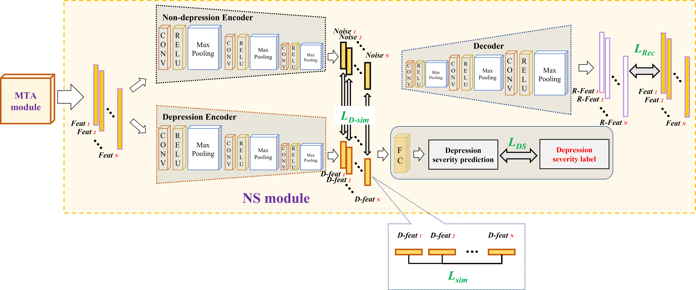

<p align="left">
  
</p>

# Video-based Depression Detection using Graph Representation
[中文](Readme_ZH.md)   

[English](README.md)

## Introduction
This is the official code repository for the _Two-stage Temporal Modelling Framework for Video-based Depression Recognition using Graph Representation_. For a detailed explanation, refer to our paper: [arXiv:2111.15266](https://arxiv.org/abs/2111.15266).

The project introduces a two-stage model for video-based depression detection:
- **Short-term Depressive Behavior Modeling** using the Multi-scale Temporal Behavioural Feature Extraction-Depression Feature Enhancement (MTB-DFE) model.
- **Video-level Depressive Behavior Modeling** using Spectral Encoding Graph (SEG) and Spectral Propagation Graph (SPG) models.
The models have been tested on the AVEC 2013, AVEC 2014, and AVEC 2019 datasets.

<p align="center">
  
</p>

## Getting Started

### Installation

#### Clone the repository
```bash
git clone https://github.com/jiaqi-pro/Depression-detection-Graph.git
pip install -r requirements.txt
```

### Dataset
#### Download the dataset

The project utilizes the AVEC 2013, AVEC 2014, and AVEC 2019 datasets for training and testing.

You need to contact the authors to gain access to the datasets.

#### Data Preprocessing

_No face extraction step is needed for the AVEC 2019 dataset as it provides feature files._

1. Use [OpenFace 2.0](https://github.com/TadasBaltrusaitis/OpenFace) with the CE-CLM extractor to obtain face images resized to 224x224.
   Directory structure:
```
 ${DATASET_ROOT_FOLDER}
└───path_to_dataset
    └───train
        └───subject_id
            └───frame_det_00_000001.bmp
            └───frame_det_00_000002.bmp
```

2. For all datasets, adjust the length of selected videos to multiples of 30 to ensure a uniform distribution of samples. Each group of 30 frames corresponds to a depression level, saved as a text file, formatted as follows:

```
./Training_face/203_1_cut_combined_aligned/frame_det_00_000001.bmp,./Training_face/203_1_cut_combined_aligned/frame_det_00_000002.bmp,./Training_face/203_1_cut_combined_aligned/frame_det_00_000003.bmp,./Training_face/203_1_cut_combined_aligned/frame_det_00_000004.bmp,./Training_face/203_1_cut_combined_aligned/frame_det_00_000005.bmp,./Training_face/203_1_cut_combined_aligned/frame_det_00_000006.bmp,./Training_face/203_1_cut_combined_aligned/frame_det_00_000007.bmp,./Training_face/203_1_cut_combined_aligned/frame_det_00_000008.bmp,./Training_face/203_1_cut_combined_aligned/frame_det_00_000009.bmp,./Training_face/203_1_cut_combined_aligned/frame_det_00_000010.bmp,./Training_face/203_1_cut_combined_aligned/frame_det_00_000011.bmp,./Training_face/203_1_cut_combined_aligned/frame_det_00_000012.bmp,./Training_face/203_1_cut_combined_aligned/frame_det_00_000013.bmp,./Training_face/203_1_cut_combined_aligned/frame_det_00_000014.bmp,./Training_face/203_1_cut_combined_aligned/frame_det_00_000015.bmp,./Training_face/203_1_cut_combined_aligned/frame_det_00_000016.bmp,./Training_face/203_1_cut_combined_aligned/frame_det_00_000017.bmp,./Training_face/203_1_cut_combined_aligned/frame_det_00_000018.bmp,./Training_face/203_1_cut_combined_aligned/frame_det_00_000019.bmp,./Training_face/203_1_cut_combined_aligned/frame_det_00_000020.bmp,./Training_face/203_1_cut_combined_aligned/frame_det_00_000021.bmp,./Training_face/203_1_cut_combined_aligned/frame_det_00_000022.bmp,./Training_face/203_1_cut_combined_aligned/frame_det_00_000023.bmp,./Training_face/203_1_cut_combined_aligned/frame_det_00_000024.bmp,./Training_face/203_1_cut_combined_aligned/frame_det_00_000025.bmp,./Training_face/203_1_cut_combined_aligned/frame_det_00_000026.bmp,./Training_face/203_1_cut_combined_aligned/frame_det_00_000027.bmp,./Training_face/203_1_cut_combined_aligned/frame_det_00_000028.bmp,./Training_face/203_1_cut_combined_aligned/frame_det_00_000029.bmp,./Training_face/203_1_cut_combined_aligned/frame_det_00_000030.bmp,3
```
### Training Process Overview

#### Stage One: Training the MTB-DFE Model

This stage focuses on training the Multi-scale Temporal Behavioral Feature Extraction-Depression Feature Enhancement (MTB-DFE) model, which captures and enhances short-term depressive behavior features from video sequences.

#### Architecture Overview

##### MTB (Multi-scale Temporal Behavioral Feature Extraction)

**MTB.py**: Defines the MTB model based on the Temporal Pyramid Network (TPN), designed to capture multi-scale spatio-temporal behavioral features from video sequences.

<p align="center">
  
</p>

**Input**:
- Video frame sequence: The MTB component processes a series of preprocessed video frames, each typically sized 224x224.

**Output**:
- Multi-scale features: Extracted through a 3D convolutional network (e.g., 3D ResNet), capturing the dynamics and spatial details of behavior in the videos.

##### DFE (Depression Feature Enhancement)

###### MTA (Mutual Temporal Attention)

**MTA.py**: Defines the MTA model, which applies an attention mechanism to the features extracted by MTB, highlighting key temporal segments indicative of depressive behaviors.

<p align="center">
  
</p>

**Input**:
- Multi-scale spatio-temporal behavioral feature vectors from MTB.

**Intermediate Variables**:
- Weighted feature vectors: MTA enhances features highly related to depressive states through its attention layer, denoted as \(f^{MTA}\).

**Output**:
- MTA prediction results: Outputs depression state predictions through a fully connected layer, used for evaluating model performance.

**Training Process**:
- **Loss Calculation**: \(Loss_{MTA}\) is the mean squared error (MSE) between MTA's predictions and the depression labels, used to assess the accuracy of MTA predictions.


```python

from MTA import MTA

model = MTA()
# Assume dataloader, optimizer have been defined
for epoch in range(num_epochs):
    for inputs, labels in dataloader:
        predict_result,loss,MTA_feature =  model(inputs,labels) # inputs:[B, T, C, H, W] ,labels:[B]
        loss = loss['loss_aux']
        optimizer.zero_grad()
        loss.backward()
        optimizer.step()
        print(f'Epoch {epoch+1}, Loss: {loss.item()}')
```

###### NS (Noise Separation)

**NS.py**: Defines the NS model, which filters out noise from the enhanced features provided by MTA, focusing on clearer, depression-specific signal enhancement.

<p align="center">
  
</p>

**Input**:
- Weighted feature vectors from MTA \(f^{MTA}\).

**Intermediate Variables**:
- Depression-related features \(D-feat_i\): Extracted by a depression encoder from the input features.
- Non-depression-related features \(Noise_i\): Extracted by a non-depression encoder from the input features.
- Reconstructed features \(R-Feat_i\): Generated by a reconstruction decoder from the input features.

**Output**:
- NS prediction results: \(D-feat_i\) outputs depression state predictions through a fully connected layer, used for evaluating model performance.

**Model Integration and Training**:

The MTB-DFE model integrates inputs, processes them through the MTB, MTA, and NS components, and outputs predictions as follows:

1. **Input**: Video frame sequence -> **MTB** -> Multi-scale spatio-temporal behavioral feature vectors.
2. **Process**: Multi-scale spatio-temporal behavioral feature vectors -> **MTA** -> Weighted feature vectors.
3. **Output**: Weighted feature vectors -> **NS** -> Intermediate variables and NS prediction results.

**Training Loss Functions**:
During the training of the MTB-DFE model, the following loss functions are combined for end-to-end optimization:
- \(Loss_{short} = Loss_{NS} + w_1 \times Loss_{MTA} + w_2 \times Loss_{Sim} + w_3 \times Loss_{DiffSim} + w_4 \times Loss_{Reconstruction}\)
- Where \(w_1, w_2, w_3, w_4\) are hyperparameters that can be adjusted based on practical scenarios. Each loss component is defined in `Loss.py`.

```python
from loss import SIMSE, Reconstruction, DiffLoss, NS_Regression_loss
model = MTB_DFE()
# Initialize the loss functions
simse = SIMSE()
reconstruction = Reconstruction()
diff_simse = DiffLoss()
NS_Regression_loss = NS_Regression_loss()

w_1, w_2, w_3, w_4 = 1, 1, 1, 1

for epoch in range(num_epochs):
    for input_tensor, label in dataloader:
 
        Noise, D_feat, NS_result, R_feat,loss_aux,F_mta= model(input_tensor,label)
		
		indices = torch.randperm(D_feat.size(0))

		# shuffle D_feature by the first dimension
		shuffle_D_feat = D_feat[indices]
        # Calculate the loss
		loss_mta = loss_aux['loss_aux']  # MTA Loss
		loss0 = NS_Regression_loss(NS_result, label)  # NS Loss
		loss1 = simse(D_feat, shuffle_D_feat)  # Similarity MSE Loss
		loss2 = diff_simse(Noise, D_feat)  # Diff-Similarity Loss
		loss3 = reconstruction(R_feat, F_mta)  # Reconstruction Loss
		total_loss = loss0 + w_1 * loss_mta + w_2 * loss1 + w_3 * loss2 + w_4 * loss3

        optimizer.zero_grad()
        total_loss.backward()
        optimizer.step()
        print(f"Epoch {epoch+1}, Loss: {loss.item()}")

```
**Detailed Descriptions of Each Loss Function**:

1. **$Loss_{DiffSim}$ (Difference Similarity Loss)**
   - **Description**: $Loss_{DiffSim}$ aims to reduce the correlation between depression features (Depression feature) and non-depression features (Non-Depression feature). This loss evaluates the similarity between these two types of features to optimize their distinguishability.
   - **Implementation**: Uses the `DiffLoss` class, which first normalizes and centers the input features, then calculates the inner product matrix of these features, and finally averages the squares of the matrix elements.

2. **$Loss_{Sim}$ (Similarity MSE Loss)**
   - **Description**: $Loss_{Sim}$ is the mean squared error (MSE) between depression features. This loss function evaluates the consistency between similar features to enhance the accuracy of the model in extracting depression features.

3. **$Loss_{Reconstruction}$ (Reconstruction Loss)**
   - **Description**: $Loss_{Reconstruction}$ is the mean squared error (MSE) between depression features and reconstructed features. This loss evaluates the quality of the reconstruction process, ensuring the reconstructed features closely match the original input features.

4. **$Loss_{MTA}$ (MTA Regression Loss)**
   - **Description**: $Loss_{MTA}$ calculates the mean squared error (MSE) between MTA's predictions and the depression labels. This loss evaluates the accuracy of the MTA module in predicting depression states, aiding the model in focusing on key behavioral features.

5. **$Loss_{NS}$ (NS Regression Loss)**
   - **Description**: $Loss_{NS}$ calculates the mean squared error (MSE) between NS's predictions and the depression labels. This loss optimizes the performance of the NS module, ensuring the noise separation process effectively enhances the clarity of the feature signals.

#### Stage Two: Training the SEG/SPG Models

<p align="center">
  
</p>

##### SEG (Sequential Graph Representations)

**SEG.py**: Defines the SEG model, which integrates short-term depression-related features \(D-feat_i\) from the MTB_DFE output, irrespective of length, using a graph structure for prediction.

**Input**:
- Sequence of short-term depression-related features from MTB_DFE \([D-feat_1, D-feat_2, ..., D-feat_n]\).

**Intermediate Variables**:
- SEG's Graph structure: Constructs a graph to integrate the short-term depression-related features \(D-feat_i\).

**Output**:
- SEG prediction results: SEG predicts depression levels through graph attention network (GAT) message passing and aggregation.

**Training Process**:
- **Loss Calculation**: \(Loss_{SEG}\) is the mean squared error (MSE) between SEG's predictions and the depression labels, used to assess the accuracy of SEG predictions.

```
from SEG import build_graph, GATNet
loss_SEG = SEG_loss()
 for epoch in range(num_epochs):
	for input_tensor, label in dataloader:
		G = build_graph(input_data)
		e = torch.ones(G.num_edges(),1).long()
		result = model(G,input_data,e)
		# Calulate the loss
		loss = loss_SEG(result,label)
		optimizer.zero_grad()
		loss.backward()
		optimizer.step()
		print(f"Epoch {epoch+1}, Loss: {loss.item()}")
```
###### SPG (Spectral Propagation Graph)

**SPG.py**: Defines the SPG model, which applies Discrete Fourier Transform (DFT) to extract spectral signals \(B_n\) from time-series data for constructing a graph representation of depression states.

**Preprocessing**:
- Use `SpectralRepresentation.mlx` to process the sequence of short-term depression-related features \([D-feat_1, D-feat_2, ..., D-feat_n]\) from MTB-DFE, obtaining spectral signals \(B_n\).

**Input**:
- **Spectral signals \(B_n\)**: Spectral signals derived from depression-related features through Discrete Fourier Transform (DFT), used to construct the graph model.

**Intermediate Variables**:
- **SPG's Graph structure**: Converts the spectral signals \(B_n\) into a graph structure, where each node represents a spectral feature and the edges between nodes represent the relationships between features.

**Output**:
- **SPG prediction results**: SPG predicts depression levels through graph attention network (GAT) message passing and feature aggregation.

**Training Process**:
- **Loss Calculation**: **\(Loss_{SPG}\)**: Calculates the mean squared error (MSE) between SPG's predicted depression levels and the actual depression labels, used to assess the accuracy of SPG predictions.

```
from SPG import build_graph, GATNet
loss_SPG = SPG_loss()
 for epoch in range(num_epochs):
	for input_tensor, label in dataloader:
		G = build_graph(input_data)
		e = torch.ones(G.num_edges(),1).long()
		result = model(G,input_data,e)
		# Calulate the loss
		loss = loss_SPG(result,label)
		optimizer.zero_grad()
		loss.backward()
		optimizer.step()
		print(f"Epoch {epoch+1}, Loss: {loss.item()}")
```
## Weight Downloads

Model weights and preprocessed features can be accessed via the following links:
- Baidu Cloud: [Link: https://pan.baidu.com/s/1woEGqgiaCVRepMkWOUIk9Q?pwd=5h2n Code: 5h2n]
- Google Drive: [https://drive.google.com/drive/folders/1JOvTZcVl7EXJnCkhrdAS1dRiN52HD1kj?usp=sharing]

## Considerations

Please adhere to the terms of use for the datasets and refer to the detailed guidelines to ensure the replicability and ethical conduct of the research.

## Future Work

- [ ] Convert **Spectral Representation** to a Python version.
- [ ] Provide **Inference.py**, which takes a video file and predicts the depression level directly.
- [ ] Design a GUI interface or an executable program for easier use.

## Citations and Acknowledgments

This project builds on the following research and acknowledges their contributions:
1. Valstar M, Schuller B, Smith K, et al. Avec 2013: the continuous audio/visual emotion and depression recognition challenge[C]. 2013.
2. Valstar M, Schuller B, Smith K, et al. Avec 2014: 3d dimensional affect and depression recognition challenge[C]. 2014.
3. Ringeval F, Schuller B, Valstar M, et al. AVEC 2019 workshop and challenge: state-of-mind, detecting depression with AI, and cross-cultural affect recognition[C]. 2019.
4. Yang C, Xu Y, Shi J, et al. Temporal pyramid network for action recognition[C]. 2020.
5. Song S, Jaiswal S, Shen L, et al. Spectral representation of behaviour primitives for depression analysis[J]. IEEE Transactions on Affective Computing, 2020.
