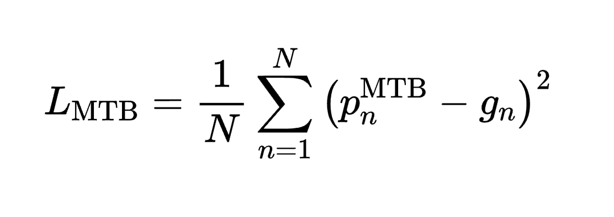
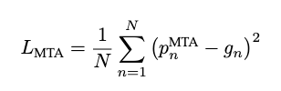
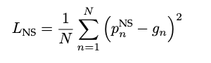
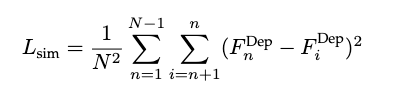
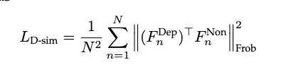
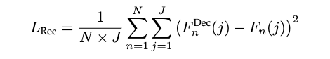

  

# Graph-based Video Depression Recognition
[中文 README](README.md)

## Overview

This project is an open-source code repository for video depression state recognition using graph neural networks, aiming to integrate video data information comprehensively through advanced graph representation techniques to achieve accurate detection of depressive states. Our research work demonstrates how to use graph neural networks to process and analyze video data to identify individuals' depression states, utilizing AVEC 2013, AVEC 2014, and AVEC 2019 datasets for training and testing.

  

The image above displays the main components of the model, including three key modules: MTB (Multi-scale Temporal Behavioural Feature Extraction), DFE (Depression Feature Enhancement), and a graph encoding module for integrating video-level feature representation and conducting the final depression state assessment through graph neural networks.

## Model Introduction
### Multi-scale Temporal Behavioural Feature Extraction (MTB)

  

The MTB module is built upon the Temporal Pyramid Network (TPN) and utilizes multiple branches to learn multi-scale spatio-temporal features from video sequences. Each branch is based on the 3D ResNet structure and initialized with pre-trained weights from ResNet50.

### Depression Feature Enhancement (DFE)
#### Mutual Temporal Attention (MTA)

  

The MTA sub-module aims to enhance depression-related features and reduce non-depressive noise, thus improving the relevance and robustness of feature representation.

#### Noise Separation (NS)

  

The NS sub-module focuses on further separating and reducing non-depressive noise to optimize the quality of the final feature representation.

### SEG & SPG

  

To address the challenge of varying video lengths, we employ the Spectral Encoding Algorithm to transform depression-related features into length-insensitive spectral vectors, followed by constructing graph representations for video-level depression state prediction.

## Usage Process
### Data Preprocessing
- **AVEC 2013 & AVEC 2014**: Use [Openface 2.0](https://github.com/TadasBaltrusaitis/OpenFace) for facial extraction, with the CE-CLM extractor.
- **AVEC 2019**: Since feature files are provided, additional facial extraction steps are unnecessary.

For all datasets, video lengths are adjusted to multiples of 30 to achieve uniformly distributed sample groups.

### Running the code
1. Run `MTB-DFE.py` to obtain short-term depression behavioral features.
`python MTB-DFE.py`
2. Run `SpectralRepresentation.mlx` to obtain spectral vectors.
3. Run `SEG.py` to obtain depression levels.
`python SEG.py`

## Project Structure and Model Details

This project focuses on the task of depression state recognition in video datasets, processing both AVEC 2013 & 2014 video datasets and the AVEC 2019 feature dataset. The organization and functionality of each part are detailed below.

### AVEC 2013 & AVEC 2014 Datasets

#### Multi-scale Temporal Behavioural Feature Extraction (MTB)
- **MTB.py**: Defines the MTB model. This model, built on the Temporal Pyramid Network (TPN), aims to capture multi-scale spatio-temporal behavioral features from video sequences.
- **Loss.py -> MTB_loss**: Defines the loss function for the MTB model, used to optimize model performance.

  

#### Depression Feature Enhancement (DFE)
- **MTA_dataloader.py**: Responsible for data loading, supporting the MTA module.
- **MTA_Resnet.py**: Defines parameters based on ResNet, constructing the foundational feature extraction network.
- **MTA_TPN.py**: Defines TPN-related parameters for capturing behavioral features at different temporal scales.
- **Loss.py -> MTA_loss**: Defines the loss function for the MTA model, used to optimize model performance.

  

#### Noise Separation (NS)
- **NS.py**: Definition of the NS model, aimed at separating noise from depression features to optimize feature representation quality.
- **Loss.py -> NS_loss**: Defines the loss function for the NS model, used to optimize model performance.

  

- **Loss.py -> Sim_loss**: Defines a similarity loss function, used for learning depressive features.

  

- **Loss.py -> DiffSim_loss**: Defines a differential similarity loss function, used to emphasize the differences between depressive and non-depressive features.

  

- **Loss.py -> Reconstruction_loss**: Defines a reconstruction loss function, used to optimize the quality of feature representation.

  

- **MTB+DFE.py**: Integrates the MTB and DFE modules to enhance and optimize depressive features.

Besides, shows the loss function within the MTB+DFE model, used to optimize model performance.

  

#### Spectral Representation
- **SpectralRepresentation.mlx**: Converts depression-related features into spectral vectors, insensitive to video length.

#### SEG & SPG
- **gat_layer.py**: Defines the Graph Attention Network (GAT) layer for learning complex interactions between nodes in the graph.
- **mlp_readout_layer.py**: Defines the MLP readout layer to extract useful information from the graph representation.
- **gat_net.py**: Definition of the GAT network, integrating layers to build the complete graph neural network model.
- **SEG.py** & **SPG.py**: Define the SEG and SPG models, responsible for converting spectral vectors into graph representations for the final prediction of depression states.
- **Loss.py -> SEG_loss**: Defines the loss function for the SEG model, used to optimize model performance.
- **Loss.py -> SPG_loss**: Defines the loss function for the SPG model, used to optimize model performance.

### AVEC 2019 Dataset

#### Model
- **MTB.py**, **MTA.py**, **NS.py**: Define the MTB, MTA, and NS modules, respectively. These modules use a similar design philosophy as for the video datasets but are adapted for the AVEC 2019 feature dataset.

#### graph-resnet
- **SPG.py**: Contains the definition and training process of the SPG model, handling graph representation and state prediction.
- **SEG.py**: Contains the definition and training process of the SEG model, responsible for constructing and optimizing spectral representation.

### Model Training

Each module contains corresponding training scripts, providing detailed instructions and parameter settings to ensure efficient and smooth model training. The training process for AVEC 2013 and AVEC 2014 datasets can also refer to the training code for the AVEC 2019 dataset, ensuring method consistency and reusability.

## Environment Setup
To ensure the code runs properly, please make sure the following dependencies are installed:
`pip install -r requirements.txt`

## Weight Download
Model weights and preprocessed features can be obtained through the following links:
- BaiduYun：[链接: https://pan.baidu.com/s/1woEGqgiaCVRepMkWOUIk9Q?pwd=5h2n 提取码: 5h2n]
- Google Drive: [https://drive.google.com/drive/folders/1JOvTZcVl7EXJnCkhrdAS1dRiN52HD1kj?usp=sharing]

## Note
Please ensure compliance with the dataset usage terms and refer to the detailed operation guide to ensure replicability and ethical research practices.

## Future Work
- [ ] 1. Convert Spectral Representation to a Python version.
- [ ] 2. Provide Inference.py, inputting a video file to directly predict the depression level.
- [ ] 3. Design a GUI interface or an exe program for ease of use.

## Citations and Acknowledgements
This project builds on the following research achievements, for which we express our gratitude and cite:
1. Valstar M, Schuller B, Smith K, et al. Avec 2013: the continuous audio/visual emotion and depression recognition challenge[C]. 2013.
2. Valstar M, Schuller B, Smith K, et al. Avec 2014: 3d dimensional affect and depression recognition challenge[C]. 2014.
3. Ringeval F, Schuller B, Valstar M, et al. AVEC 2019 workshop and challenge: state-of-mind, detecting depression with AI, and cross-cultural affect recognition[C]. 2019.
4. Yang C, Xu Y, Shi J, et al. Temporal pyramid network for action recognition[C]. 2020.
5. Song S, Jaiswal S, Shen L, et al. Spectral representation of behaviour primitives for depression analysis[J]. IEEE Transactions on Affective Computing, 2020.
