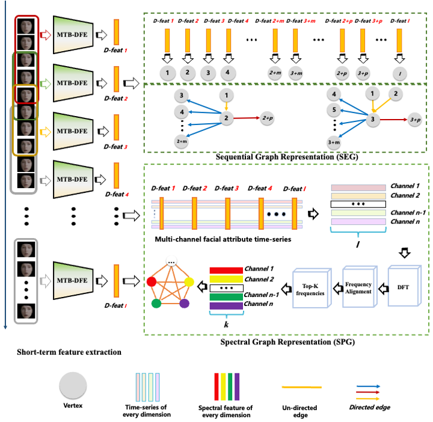

<p align="left">
  
</p>

# Video-based Depression Detection using Graph Representation
[中文](README_ZH.md)   

[English](README.md)

## Introduction
This is the official code repository for the _Two-stage Temporal Modelling Framework for Video-based Depression Recognition using Graph Representation_. For a detailed explanation, refer to our paper: [arXiv:2111.15266](https://arxiv.org/abs/2111.15266).

The project introduces a two-stage model for video-based depression detection:
- **Short-term Depressive Behavior Modeling** using the Multi-scale Temporal Behavioural Feature Extraction-Depression Feature Enhancement (MTB-DFE) model.
- **Video-level Depressive Behavior Modeling** using Spectral Encoding Graph (SEG) and Spectral Propagation Graph (SPG) models.
The models have been tested on the AVEC 2013, AVEC 2014, and AVEC 2019 datasets.

<p align="center">
  
</p>

## Getting Started

### Installation

#### Clone the repository
```bash
git clone https://github.com/jiaqi-pro/Depression-detection-Graph.git
pip install -r requirements.txt
```

### Dataset
#### Download the dataset

The project utilizes the AVEC 2013, AVEC 2014, and AVEC 2019 datasets for training and testing.

You need to contact the authors to gain access to the datasets.

#### Data Preprocessing

_No face extraction step is needed for the AVEC 2019 dataset as it provides feature files._

1. Use [OpenFace 2.0](https://github.com/TadasBaltrusaitis/OpenFace) with the CE-CLM extractor to obtain face images resized to 224x224.
   Directory structure:
```
 ${DATASET_ROOT_FOLDER}
└───path_to_dataset
    └───train
        └───subject_id
            └───frame_det_00_000001.bmp
            └───frame_det_00_000002.bmp
```

2. For all datasets, adjust the length of selected videos to multiples of 30 to ensure a uniform distribution of samples. Each group of 30 frames corresponds to a depression level, saved as a text file, formatted as follows:

```
./Training_face/203_1_cut_combined_aligned/frame_det_00_000001.bmp,./Training_face/203_1_cut_combined_aligned/frame_det_00_000002.bmp,./Training_face/203_1_cut_combined_aligned/frame_det_00_000003.bmp,./Training_face/203_1_cut_combined_aligned/frame_det_00_000004.bmp,./Training_face/203_1_cut_combined_aligned/frame_det_00_000005.bmp,./Training_face/203_1_cut_combined_aligned/frame_det_00_000006.bmp,./Training_face/203_1_cut_combined_aligned/frame_det_00_000007.bmp,./Training_face/203_1_cut_combined_aligned/frame_det_00_000008.bmp,./Training_face/203_1_cut_combined_aligned/frame_det_00_000009.bmp,./Training_face/203_1_cut_combined_aligned/frame_det_00_000010.bmp,./Training_face/203_1_cut_combined_aligned/frame_det_00_000011.bmp,./Training_face/203_1_cut_combined_aligned/frame_det_00_000012.bmp,./Training_face/203_1_cut_combined_aligned/frame_det_00_000013.bmp,./Training_face/203_1_cut_combined_aligned/frame_det_00_000014.bmp,./Training_face/203_1_cut_combined_aligned/frame_det_00_000015.bmp,./Training_face/203_1_cut_combined_aligned/frame_det_00_000016.bmp,./Training_face/203_1_cut_combined_aligned/frame_det_00_000017.bmp,./Training_face/203_1_cut_combined_aligned/frame_det_00_000018.bmp,./Training_face/203_1_cut_combined_aligned/frame_det_00_000019.bmp,./Training_face/203_1_cut_combined_aligned/frame_det_00_000020.bmp,./Training_face/203_1_cut_combined_aligned/frame_det_00_000021.bmp,./Training_face/203_1_cut_combined_aligned/frame_det_00_000022.bmp,./Training_face/203_1_cut_combined_aligned/frame_det_00_000023.bmp,./Training_face/203_1_cut_combined_aligned/frame_det_00_000024.bmp,./Training_face/203_1_cut_combined_aligned/frame_det_00_000025.bmp,./Training_face/203_1_cut_combined_aligned/frame_det_00_000026.bmp,./Training_face/203_1_cut_combined_aligned/frame_det_00_000027.bmp,./Training_face/203_1_cut_combined_aligned/frame_det_00_000028.bmp,./Training_face/203_1_cut_combined_aligned/frame_det_00_000029.bmp,./Training_face/203_1_cut_combined_aligned/frame_det_00_000030.bmp,3
```

### Training Process Overview

#### Stage One: Training the MTB-DFE Model

This stage focuses on training the Multi-scale Temporal Behavioral Feature Extraction - Depression Feature Enhancement (MTB-DFE) model, which captures and enhances short-term depression behavioral features from each given video.

Assuming we have $M$ videos, and through data processing, we extract a variable number of thin slices from each video, denoted as $I$. These slices for each video $m$ (where $m = 1, 2, \ldots, M$) are represented by $(S_1, S_2, \ldots, S_I)$. It's important to note that the number $I$ varies among the videos. Each training iteration processes batches of $N$ video clips.

****1. Input and Feature Extraction****
- *Video Frame Sequence to MTB*: Video clips $S_n, n= (1,...,N)$ are inputted into the MTB during the training iteration, yielding multi-scale spatio-temporal behavioral features $[f^{\text{MTB}}_1, f^{\text{MTB}}_2,..., f^{\text{MTB}}_k]$ for each sequence $S_n$. The dimensions of the MTB features are represented as $[N, k, J]$, where $J$ denotes the size of each feature $f^{\text{MTB}}_k$.

****2. Feature Enhancement and Preliminary Prediction****
- *MTB Output to MTA*: Each feature set $f^{\text{MTB}}_k$ from $S_n$, with dimensions $[k, J]$, is inputted into the Mutual Temporal Attention (MTA) module. This module enhances features that are strongly correlated with depressive states, producing a set of weighted feature vectors $[f^{\text{MTA}}_1, f^{\text{MTA}}_2, f^{\text{MTA}}_3,..., f^{\text{MTA}}_k]$. The dimensions of the MTA features remain $[k, J]$. These features are then **concatenated** to form the final output $F^\text{MTA}$, which is shaped as $[N, J]$. Additionally, an auxiliary prediction head estimates the severity of depression as $p_n^{\text{MTA}}, n = (1,2,...,N)$.
  - Calculate the MTA Loss Function $L_{MTA}$:

    $$L_{\text{MTA}} = \frac{1}{N} \sum_{n=1}^{N} \left(p_n^{\text{MTA}}-g_n\right)^{2}$$
where $g_n$ represents the depression level for the $n_{th}$ video clip.

****3.  In-depth Feature Separation and Loss Calculation****
- *MTA Output to NS*: Each feature $F^\text{MTA}_{n}$ from each video clip $S_n$, with dimension $J$, is inputted into the **Noise Separation (NS)** module. This module generates features related to depression, denoted as $F_{n}^\text{Dep}$, features representing non-depression-related noise, denoted as $F_{n}^\text{Non}$, and reconstructs the features of $F^\text{MTA}_{n}$, denoted as $F_{n}^\text{Dec}$. Subsequently, the depression-related features $F_{n}^\text{Dep}$ are utilized to predict the depression level $p^\text{NS}_{n}$ for each video clip $n = (1,2,...,N)$.
- *Calculate NS-related Loss*:

  - Prediction Loss Function for NS $L_{NS}$:

    $$L_{\text{NS}} = \frac{1}{N} \sum_{n=1}^{N} \left(p_n^{\text{NS}}-g_n\right)^{2}$$

  - Calculate Similarity Function $L_{sim}$:
 
    $$L_{\text{sim}} = \frac{1}{N^2}\sum_{n=1}^{N-1} \sum_{i=n+1}^n (F_{n}^\text{Dep}-F_{i}^\text{Dep})^2$$

    where $F_{n}^\text{Dep}$ and $F_{i}^\text{Dep}$ are depression-related features extracted from the shared depression encoder, while $n$ and $i$ are the indices of video clip.

  - Calculate Dissimilarity Function $L_{D-sim}$:

    $$L_{\text{D-sim}} = \frac{1}{N^2} \sum_{n=1}^{N} \left\|(F_{n}^{\text{Dep}})^{\top} F_{n}^{\text{Non}} \right\|_{\text{Frob}}^{2}$$

    where $F_{n}^{\text{Dep}}$ is the depression-related feature for the $n_{th}$ video clip. $F_{n}^{\text{Non}}$ is the non-depression-related noise for the $n_{th}$ video clip. $\left\| \cdot \right \| ^{2}_{\text{Frob}}$ represents the squared Frobenius norm.

  - Calculate Reconstruction Function $L_{Rec}$:

    $$L_{\text{Rec}} = \frac{1}{N \times J} \sum_{n=1}^{N} \sum_{j=1}^{J} \left(F_n^{\text{Dec}}(j) - F_n(j)\right)^{2}$$

    where $F_n(j)$ and $F_n^{\text{Dec}}(j)$ are the $j_{\text{th}}$ element of the $n_{\text{th}}$ input feature  $F^\text{MTA}_{n}$ and the $j_{\text{th}}$ element of the corresponding reconstructed feature generated by the decoder.
    
- *Integrating Losses*: Combine $L_{MTA}$, $L_{NS}$, $L_{sim}$, $L_{D-sim}$, and $L_{Rec}$ to form $L_{short}$ for optimizing MTB-DFE, as follows:

    $$L_{\text{short}} =  L_{\text{NS}} + W_1 \times L_{\text{MTA}} + W_2 \times L_{\text{sim}} + W_3 \times L_{\text{D-sim}} + W_4 \times L_{\text{Rec}}$$

    where $W_1$, $W_2$, $W_3$ and $W_4$ are weights indicating the importance of each loss component. Here, we set all of them as 1.

- *Backpropagation*: The loss $L_{\text{short}}$ is then backpropagated to optimize the parameters within the MTB-DFE model.


<p align="center">
  
</p>

#### Stage Two: Training the SEG / SPG Models

****SEG (Sequential Graph Representation)****
- *Feature Integration*: The depression-related features of the $m_{th}$ video clip are aggregated from the features extracted by the NS module, denoted as $F_{i}^\text{Dep}, i= (1,2,...,I)$.
- *Depression Level Prediction*: The feature set of the $m_{th}$ video is fed into the *SEG* module to predict the depression level, denoted as $p^{SEG}_{m}$.
- Calculate the prediction loss function for **SEG**, $L_{SEG}$:
$$
L_{\text{SEG}} = \frac{1}{M} \sum_{m=1}^{M} \left(p_m^{\text{SEG}}-g_m\right)^{2}
$$

     where $p_m^{\text{SEG}}$ represents the predicted depression level for the $m_{th}$ video as determined by **SEG**. Additionally, $g_m$ denotes the actual depression level for the $m_{th}$ video.

- *Backpropagation*: The loss $L_{\text{SEG}}$ is then backpropagated to optimize the parameters within the SEG model.

****SPG (Spectral Graph Representation)****
- *Feature Integration*: The depression-related features of the $m_{th}$ video clip are aggregated from the features extracted by the NS module, denoted as $F_{i}^\text{Dep}, i= (1,2,...,I)$.
- *Spectral Feature Processing*: The output $F_{i}^\text{Dep}, i= (1,2,...,I)$ from the **NS** module for each $m_{th}, m= (1,2,...,M)$ video is processed through `SpectralRepresentation.mlx` to obtain the spectral signal $B_m$, whose dimensions are $[J,K]$. Here, $J$ represents facial attributes, and $K$ denotes the number of low-frequency components.

- *Depression Level Prediction*: The spectral signal $B_m$ of the $m_{th}$ video is inputted into the *SPG* model to predict the depression level $p_m^{SPG}$.

- Calculate the prediction loss function for **SPG**, $L_{SPG}$:
$$
L_{\text{SPG}} = \frac{1}{M} \sum_{m=1}^{M} \left(p_m^{\text{SPG}}-g_m\right)^{2}
$$

    where $p_m^{\text{SPG}}$ represents the predicted depression level for the $m_{th}$ video by **SPG**. $g_m$ represents the actual depression level for the $m_{th}$ video.

- *Backpropagation*: The loss $L_{\text{SPG}}$ is then backpropagated to optimize the parameters within the SPG model.


## Weight Downloads

Model weights and preprocessed features can be accessed via the following links:
- Baidu Cloud: [Link: https://pan.baidu.com/s/1woEGqgiaCVRepMkWOUIk9Q?pwd=5h2n Code: 5h2n]
- Google Drive: [https://drive.google.com/drive/folders/1JOvTZcVl7EXJnCkhrdAS1dRiN52HD1kj?usp=sharing]

## Considerations

Please adhere to the terms of use for the datasets and refer to the detailed guidelines to ensure the replicability and ethical conduct of the research.

## Future Work

- [ ] Convert **Spectral Representation** to a Python version.
- [ ] Provide **Inference.py**, which takes a video file and predicts the depression level directly.
- [ ] Design a GUI interface or an executable program for easier use.

## Citations and Acknowledgments

This project builds on the following research and acknowledges their contributions:
1. Valstar M, Schuller B, Smith K, et al. Avec 2013: the continuous audio/visual emotion and depression recognition challenge[C]. 2013.
2. Valstar M, Schuller B, Smith K, et al. Avec 2014: 3d dimensional affect and depression recognition challenge[C]. 2014.
3. Ringeval F, Schuller B, Valstar M, et al. AVEC 2019 workshop and challenge: state-of-mind, detecting depression with AI, and cross-cultural affect recognition[C]. 2019.
4. Yang C, Xu Y, Shi J, et al. Temporal pyramid network for action recognition[C]. 2020.
5. Song S, Jaiswal S, Shen L, et al. Spectral representation of behaviour primitives for depression analysis[J]. IEEE Transactions on Affective Computing, 2020.
