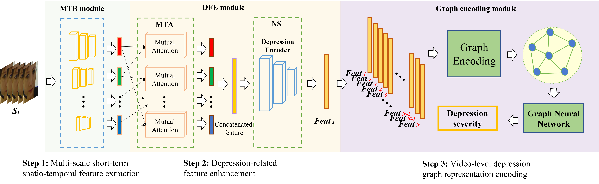

<p align="left">
  
</p>

# <div align="left">基于图表示的视频抑郁识别</div>

## <div align="left">介绍</div>
This is the official code repo of _Two-stage Temporal Modelling Framework for Video-based Depression Recognition using Graph Representation_
(https://arxiv.org/abs/2111.15266)

在这个项目里，提出了二阶段模型来进行视频别的抑郁检测，分别是短期抑郁行为建模 & 视频级别抑郁行为建模。
- 短期抑郁行为建模是基于Multi-scale Temporal Behavioural Feature Extraction-Depression Feature Enhancement (MTB-DFE)模型
- 视频级别抑郁行为建模是根据Spectral Encoding Graph (SEG) | Spectral Propagation Graph (SPG)模型
详细的说明请参阅我们的论文(https://arxiv.org/abs/2111.15266)

所有的模型性能都是在AVEC 2013, AVEC 2014, AVEC 2019数据集上进行的测试。

<p align="center">
  
</p>


## <div align="left">Get Start</div>

### <details open> <summary>1) Installation</summary>

#### Clone the repository
```bash
git clone https://github.com/jiaqi-pro/Depression-detection-Graph.git  # clone
pip install -r requirements.txt  # install
```

### <details open> <summary>2) Dataset</summary>
#### Download the dataset

我们使用AVEC 2013、AVEC 2014以及AVEC 2019数据集进行训练和测试。

您需要联系作者以获取数据集的访问权限。


#### 数据预处理

_由于AVEC 2019提供的是特征文件，无需额外的脸部提取步骤。_

1. 使用[Openface 2.0](https://github.com/TadasBaltrusaitis/OpenFace)进行人脸提取，采用CE-CLM提取器，获得对应的人脸图片，并将图片resize成224*224的大小。
The folders are with format as:

```
 ${DATASET_ROOT_FOLDER}
└───path_to_dataset
    └───train
        └───subject_id
            └───frame_det_00_000001.bmp
            └───frame_det_00_000002.bmp
```

2. 对于所有数据集，将选定视频的长度调整为30的倍数，以确保获取均匀分布的样本组。每组30帧对应一个抑郁等级，结果将保存为文本文件，格式如下所示：
```
./Training_face/203_1_cut_combined_aligned/frame_det_00_000001.bmp,./Training_face/203_1_cut_combined_aligned/frame_det_00_000002.bmp,./Training_face/203_1_cut_combined_aligned/frame_det_00_000003.bmp,./Training_face/203_1_cut_combined_aligned/frame_det_00_000004.bmp,./Training_face/203_1_cut_combined_aligned/frame_det_00_000005.bmp,./Training_face/203_1_cut_combined_aligned/frame_det_00_000006.bmp,./Training_face/203_1_cut_combined_aligned/frame_det_00_000007.bmp,./Training_face/203_1_cut_combined_aligned/frame_det_00_000008.bmp,./Training_face/203_1_cut_combined_aligned/frame_det_00_000009.bmp,./Training_face/203_1_cut_combined_aligned/frame_det_00_000010.bmp,./Training_face/203_1_cut_combined_aligned/frame_det_00_000011.bmp,./Training_face/203_1_cut_combined_aligned/frame_det_00_000012.bmp,./Training_face/203_1_cut_combined_aligned/frame_det_00_000013.bmp,./Training_face/203_1_cut_combined_aligned/frame_det_00_000014.bmp,./Training_face/203_1_cut_combined_aligned/frame_det_00_000015.bmp,./Training_face/203_1_cut_combined_aligned/frame_det_00_000016.bmp,./Training_face/203_1_cut_combined_aligned/frame_det_00_000017.bmp,./Training_face/203_1_cut_combined_aligned/frame_det_00_000018.bmp,./Training_face/203_1_cut_combined_aligned/frame_det_00_000019.bmp,./Training_face/203_1_cut_combined_aligned/frame_det_00_000020.bmp,./Training_face/203_1_cut_combined_aligned/frame_det_00_000021.bmp,./Training_face/203_1_cut_combined_aligned/frame_det_00_000022.bmp,./Training_face/203_1_cut_combined_aligned/frame_det_00_000023.bmp,./Training_face/203_1_cut_combined_aligned/frame_det_00_000024.bmp,./Training_face/203_1_cut_combined_aligned/frame_det_00_000025.bmp,./Training_face/203_1_cut_combined_aligned/frame_det_00_000026.bmp,./Training_face/203_1_cut_combined_aligned/frame_det_00_000027.bmp,./Training_face/203_1_cut_combined_aligned/frame_det_00_000028.bmp,./Training_face/203_1_cut_combined_aligned/frame_det_00_000029.bmp,./Training_face/203_1_cut_combined_aligned/frame_det_00_000030.bmp,3
```


### 训练流程概述

#### 阶段一：训练 MTB-DFE 模型

该阶段侧重于训练多尺度时空行为特征提取-抑郁特征增强（MTB-DFE）模型，该模型从视频序列中捕获并增强短期抑郁行为特征。

#### 架构概览

##### MTB（多尺度时空行为特征提取）

**MTB.py**: 定义了建立在时间金字塔网络（TPN）基础上的 MTB 模型，用以捕获视频序列中的多尺度时空行为特征。

<p align="center">
  
</p>

**输入**：
- 视频帧序列：MTB 组件接收一系列经过预处理的视频帧，每帧通常大小为 224x224。

**输出**：
- 多尺度时空行为特征向量：通过3D卷积网络（如3D ResNet）提取，捕获视频中的行为动态和空间细节。

##### DFE（抑郁特征增强）

###### MTA（相互时间注意力）

**MTA.py**: 定义了 MTA 模型，该模型应用注意力机制于 MTB 提取的特征，以突出显示抑郁行为的关键时间段。

<p align="center">
  
</p>

**输入**：
- 来自 MTB 的多尺度时空行为特征向量。

**中间变量**：
- 加权特征向量：MTA 通过其注意力层增强与抑郁状态高度相关的特征，记为 \(f^{MTA}\)。

**输出**：
- MTA 预测结果：通过全连接层输出抑郁状态的预测结果，用于评估模型性能。

**训练过程**：
- **损失计算**：\(Loss_{MTA}\) 是 MTA 预测值与抑郁标签的均方误差（MSE），用于评估 MTA 预测的准确性。


```python

from MTA import MTA

model = MTA()
# 假设 dataloader, optimizer 已定义
for epoch in range(num_epochs):
    for inputs, labels in dataloader:
        predict_result,loss,MTA_feature =  model(inputs,labels) # inputs:[B, T, C, H, W] ,labels:[B]
        loss = loss['loss_aux']
        optimizer.zero_grad()
        loss.backward()
        optimizer.step()
        print(f'Epoch {epoch+1}, Loss: {loss.item()}')
```

###### NS（噪声分离）

**NS.py**: 定义了 NS 模型，它从 MTA 增强的特征中过滤出噪声，聚焦于更清晰的、与抑郁相关的信号增强。

<p align="center">
  
</p>

**输入**：
- 来自 MTA 的加权特征向量 \(f^{MTA}\)。

**中间变量**：
- 抑郁相关特征 \(D-feat_i\)：通过抑郁编码器从输入特征中提取。
- 与抑郁无关特征 \(Noise_i\)：通过非抑郁编码器从输入特征中提取。
- 重构特征 \(R-Feat_i\)：通过重构解码器从输入特征中生成。

**输出**：
- NS 预测结果：\(D-feat_i\) 通过全连接层输出抑郁状态的预测结果，用于评估模型性能。

**模型集成和训练**：

MTB-DFE 模型集成了输入，通过 MTB、MTA 和 NS 组件处理，并输出预测，过程如下：

1. **输入**：视频帧序列 -> **MTB** -> 多尺度时空行为特征向量。
2. **处理**：多尺度时空行为特征向量 -> **MTA** -> 加权特征向量。
3. **输出**：加权特征向量 -> **NS** -> 中间变量和 NS 预测结果。

**训练的损失函数**：
在 MTB-DFE 模型的训练过程中，综合上述损失函数来进行端到端的优化：
- \(Loss_{short} = Loss_{NS} + w_1 \times Loss_{MTA} + w_2 \times Loss_{Sim} + w_3 \times Loss_{DiffSim} + w_4 \times Loss_{Reconstruction}\)
- 其中 \(w_1, w_2, w_3, w_4\) 是可以根据实际情况调整的超参数。每个损失组件在 `Loss.py` 中定义。


```python
from loss import SIMSE, Reconstruction, DiffLoss, NS_Regression_loss
model = MTB_DFE()
# 初始化各个损失函数
simse = SIMSE()
reconstruction = Reconstruction()
diff_simse = DiffLoss()
NS_Regression_loss = NS_Regression_loss()

w_1, w_2, w_3, w_4 = 1, 1, 1, 1

for epoch in range(num_epochs):
    for input_tensor, label in dataloader:
 
        Noise, D_feat, NS_result, R_feat,loss_aux,F_mta= model(input_tensor,label)
		
		indices = torch.randperm(D_feat.size(0))

		# 使用索引来 shuffle 第一个维度
		shuffle_D_feat = D_feat[indices]
        # 损失函数计算
		loss_mta = loss_aux['loss_aux']  # MTA 损失
		loss0 = NS_Regression_loss(NS_result, label)  # NS 损失
		loss1 = simse(D_feat, shuffle_D_feat)  # 相似度损失
		loss2 = diff_simse(Noise, D_feat)  # 差异性相似度损失
		loss3 = reconstruction(R_feat, F_mta)  # 重建损失
		total_loss = loss0 + w_1 * loss_mta + w_2 * loss1 + w_3 * loss2 + w_4 * loss3

        optimizer.zero_grad()
        loss.backward()
        optimizer.step()
        print(f"Epoch {epoch+1}, Loss: {loss.item()}")

```


以下是各个损失函数的详细说明：

1. **$Loss_{DiffSim}$ (Difference Similarity Loss)**
   - **描述**：$Loss_{DiffSim}$ 旨在减少抑郁特征（Depression feature）和非抑郁特征（Non-Depression feature）之间的相关性。此损失通过评估两类特征的相似度来优化特征的区分能力。
   - **实现**：使用 `DiffLoss` 类，该类首先对输入的特征进行去均值化和归一化处理，然后计算这些特征的内积矩阵，最后对该矩阵的平方求均值。

2. **$Loss_{Sim}$ (Similarity MSE Loss)**
   - **描述**：$Loss_{Sim}$ 是 Depression feature 之间的均方误差（MSE）。此损失函数用于评估相同类别特征间的一致性，增强模型在抑郁特征提取上的准确性。

3. **$Loss_{Reconstruction}$ (Reconstruction Loss)**
   - **描述**：$Loss_{Reconstruction}$ 是抑郁特征与重建特征之间的均方误差（MSE）。此损失用于评估重建特征与原始输入特征的相似度，确保重建过程的质量。

4. **$Loss_{MTA}$ (MTA Regression Loss)**
   - **描述**：$Loss_{MTA}$ 计算 MTA 的预测值与抑郁标签的均方误差（MSE）。此损失用于评估 MTA 模块在预测抑郁状态方面的准确性，帮助模型更好地聚焦关键行为特征。

5. **$Loss_{NS}$ (NS Regression Loss)**
   - **描述**：$Loss_{NS}$ 计算 NS 的预测值与抑郁标签的均方误差（MSE）。此损失用于优化 NS 模块的性能，确保噪声分离过程能有效地提高特征的信号清晰度。


#### 阶段二：训练 SEG/SPG 模型

<p align="center">
  
</p>

##### SEG(Sequential Graph Representations )

**SEG.py**: 定义了 SEG 模型，它从 MTB_DFE 得出的短期抑郁相关特征\(D-feat_i\)进行整合, 无需考虑长度, 通过图结构进行预测。


**输入**：
- 来自 MTB_DFE 的短期抑郁相关特征\(D-feat_i\)序列, [\(D-feat_1\, \(D-feat_2\, ..., \(D-feat_n\)]。

**中间变量**：
- SEG的Graph结构：通过构建图结构，将短期抑郁相关特征\(D-feat_i\)进行整合。

**输出**：
- SEG 预测结果：SEG通过通过图注意力网络 (GAT) 消息传递、聚合后预测的抑郁等级

**训练过程**：
- **损失计算**：\(Loss_{SEG}\) 是 SEG 预测值与抑郁标签的均方误差（MSE），用于评估 SEG 预测的准确性。

```
from SEG import build_graph, GATNet
loss_SEG = SEG_loss()
 for epoch in range(num_epochs):
	for input_tensor, label in dataloader:
		G = build_graph(input_data)
		e = torch.ones(G.num_edges(),1).long()
		result = model(G,input_data,e)
		# 损失函数计算
		loss = loss_SEG(result,label)
		optimizer.zero_grad()
		loss.backward()
		optimizer.step()
		print(f"Epoch {epoch+1}, Loss: {loss.item()}")
```
###### SPG (Spectral Propagation Graph)

**SPG.py**: 定义了 SPG 模型，该模型通过应用离散傅里叶变换（DFT）来从时间序列数据中提取频谱信号 \(B_n\)，用于构建抑郁状态的图表示。

**预处理**：
- 使用 `SpectralRepresentation.mlx` 对来自 MTB-DFE 的短期抑郁相关特征序列 \([D-feat_1, D-feat_2, ..., D-feat_n]\) 进行处理，得到频谱信号 \(B_n\)。

**输入**：
- **Spectral signals \(B_n\)**：通过离散傅里叶变换 (DFT) 从抑郁相关特征中提取的频谱信号，这些信号将被用来构建图模型。

**中间变量**：
- **SPG 的图结构**：将频谱信号 \(B_n\) 转换为图结构，图中的每个节点代表一个频谱特征，节点之间的边表示特征间的关系。

**输出**：
- **SPG 预测结果**：通过图注意力网络 (GAT) 进行消息传递和特征聚合后，SPG 模型预测的抑郁等级。

**训练过程**：
- **损失计算**：**\(Loss_{SPG}\)**：计算 SPG 模型预测的抑郁等级与真实抑郁标签之间的均方误差（MSE），用于评估 SPG 模型预测的准确性。

```
from SPG import build_graph, GATNet
loss_SPG = SPG_loss()
 for epoch in range(num_epochs):
	for input_tensor, label in dataloader:
		G = build_graph(input_data)
		e = torch.ones(G.num_edges(),1).long()
		result = model(G,input_data,e)
		# 损失函数计算
		loss = loss_SPG(result,label)
		optimizer.zero_grad()
		loss.backward()
		optimizer.step()
		print(f"Epoch {epoch+1}, Loss: {loss.item()}")
```

## <div align="left">权重下载</div>
模型权重和预处理特征可以通过以下链接获取：
- 百度云链接：[链接: https://pan.baidu.com/s/1woEGqgiaCVRepMkWOUIk9Q?pwd=5h2n 提取码: 5h2n]
- Google Drive: [https://drive.google.com/drive/folders/1JOvTZcVl7EXJnCkhrdAS1dRiN52HD1kj?usp=sharing]

## <div align="left">注意事项</div>
请确保遵守数据集的使用条款，并参考详细的操作指南以保证研究的可复制性和道德性。

## <div align="left">后续工作</div>
- [ ] 1. 将**Spectral Representation**变为python版本。
- [ ] 2. 提供**Inference.py**, 输入一个video文件，可以直接预测抑郁等级。
- [ ] 3. 设计成GUI界面 或者 exe程序，方便后使用。

## <div align="left">引用和致谢</div>
本项目建立在以下研究成果之上，特此表示感谢并引用：
1. Valstar M, Schuller B, Smith K, et al. Avec 2013: the continuous audio/visual emotion and depression recognition challenge[C]. 2013.
2. Valstar M, Schuller B, Smith K, et al. Avec 2014: 3d dimensional affect and depression recognition challenge[C]. 2014.
3. Ringeval F, Schuller B, Valstar M, et al. AVEC 2019 workshop and challenge: state-of-mind, detecting depression with AI, and cross-cultural affect recognition[C]. 2019.
4. Yang C, Xu Y, Shi J, et al. Temporal pyramid network for action recognition[C]. 2020.
5. Song S, Jaiswal S, Shen L, et al. Spectral representation of behaviour primitives for depression analysis[J]. IEEE Transactions on Affective Computing, 2020.
