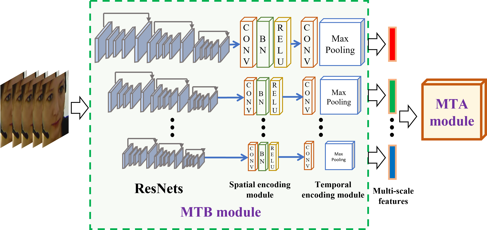
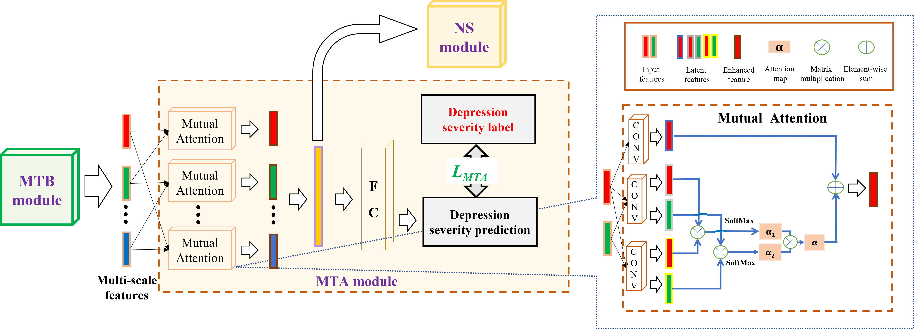
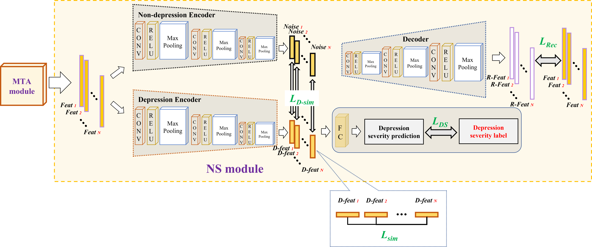
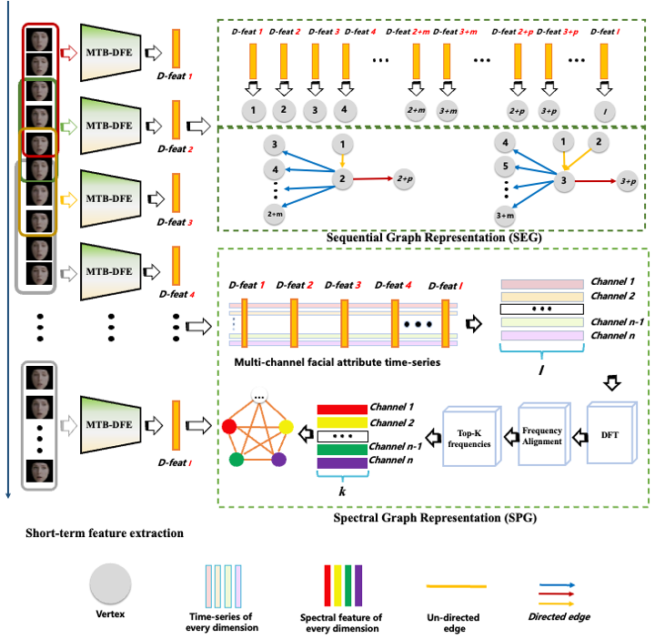

  

# 基于图表示的视频抑郁识别
[English README](README.md)

## 概述

本项目是基于图神经网络的视频抑郁状态识别的开源代码库，旨在通过先进的图表示技术全面整合视频数据信息，实现精准的抑郁状态检测。我们的研究工作展示了如何利用图神经网络处理和分析视频数据，以识别个体的抑郁状态，使用AVEC 2013、AVEC 2014和AVEC 2019数据集作为训练和测试平台。

  

上图展示了模型的主要组成部分，包括三个关键模块：MTB (多尺度时空行为特征提取)，DFE (抑郁特征增强)，以及一个图编码模块，用于将视频级特征表示整合并通过图神经网络进行最终的抑郁状态评估。

## 模型介绍
### Multi-scale Temporal Behavioural Feature Extraction (MTB)

  

MTB模块基于Temporal Pyramid Network (TPN) 构建，利用多个分支学习视频序列的多尺度时空特征。每个分支都基于3D ResNet结构，并使用ResNet50的预训练权重进行初始化。

### Depression Feature Enhancement (DFE)
#### Mutual Temporal Attention (MTA)

  

MTA子模块旨在增强抑郁相关特征并减少非抑郁噪声的影响，从而提高特征表示的相关性和鲁棒性。

#### Noise Separation (NS)

  

NS子模块专注于进一步分离和降低非抑郁噪声，优化最终特征表示的质量。

### SEG & SPG

  

为处理不同视频长度带来的挑战，我们采用Spectral Encoding Algorithm将抑郁相关特征转换为长度不敏感的光谱向量，然后构建图表示以进行视频级别的抑郁状态预测。

## 使用流程
### 数据预处理
- **AVEC 2013 & AVEC 2014**：使用[Openface 2.0](https://github.com/TadasBaltrusaitis/OpenFace)进行人脸提取，采用CE-CLM提取器。
- **AVEC 2019**：由于提供特征文件，无需额外的脸部提取步骤。

对所有数据集，选择的视频长度调整为30的倍数，以获得均匀分布的样本组。

## 项目结构和模型细节

本项目专注于视频数据集的抑郁状态识别任务，分别处理AVEC 2013、2014视频数据集和AVEC 2019特征数据集。以下详细介绍了各部分的组织结构及相应模块的功能说明。

### AVEC 2013 & AVEC 2014 数据集

#### Multi-scale Temporal Behavioural Feature Extraction (MTB)
- **MTB.py**: 定义了MTB模型。该模型基于Temporal Pyramid Network (TPN) 构建，旨在捕捉视频序列的多尺度时空行为特征。

#### Depression Feature Enhancement (DFE)
- **MTA_dataloader.py**: 负责数据加载，为MTA模块提供支持。
- **MTA_Resnet.py**: 定义了基于ResNet的参数，构建基础的特征提取网络。
- **MTA_TPN.py**: 定义了TPN相关的参数，用于在不同时间尺度上捕捉行为特征。

#### Noise Separation (NS)
- **NS.py**: NS模型的定义，旨在从抑郁特征中分离噪声，优化特征表示的质量。
- **loss.py**: 定义了模型训练过程中使用的损失函数，用于优化模型性能。

#### Spectral Representation
- **SpectralRepresentation.mlx**: 用于将抑郁相关特征转换成光谱向量，实现对视频长度的不敏感性。

#### SEG & SPG
- **gat_layer.py**: 定义了图注意力网络(GAT)层，用于学习图中节点间的复杂交互。
- **mlp_readout_layer.py**: 定义了MLP读出层，从图表示中提取有用信息。
- **gat_net.py**: GAT网络的定义，整合各层构建完整的图神经网络模型。
- **SEG.py** & **SPG.py**: 分别定义了SEG和SPG模型，负责将光谱向量转换为图表示，用于抑郁状态的最终预测。

### AVEC 2019 数据集

#### Model
- **MTB.py**, **MTA.py**, **NS.py**: 分别定义了MTB、MTA和NS模块。这些模块采用与视频数据集相似的设计理念，但对AVEC 2019的特征数据进行了适配。

#### graph-resnet
- **SPG.py**: 包含了SPG模型的定义及其训练过程，处理图表示和状态预测。
- **SEG.py**: 包含了SEG模型的定义及其训练过程，负责构建和优化光谱表示。

### 模型训练

各模块内包含相应的训练脚本，提供详细的指令和参数设置，确保模型训练的高效性和顺畅性。AVEC 2013和AVEC 2014数据集的训练过程也可以参考AVEC 2019数据集的训练代码进行，保证了方法的一致性和可复用性。

## 环境配置
为保证代码的正常运行，请确保安装以下依赖：
- mmcv
- mmaction
- torch==2.2.2
- torchvision
- tqdm
- dgl

## 权重下载
模型权重和预处理特征可以通过以下链接获取：
- 百度云链接：[链接: https://pan.baidu.com/s/1woEGqgiaCVRepMkWOUIk9Q?pwd=5h2n 提取码: 5h2n]
- Google Drive: [https://drive.google.com/drive/folders/1JOvTZcVl7EXJnCkhrdAS1dRiN52HD1kj?usp=sharing]

## 注意事项
请确保遵守数据集的使用条款，并参考详细的操作指南以保证研究的可复制性和道德性。

## 引用与致谢
本项目建立在以下研究成果之上，特此表示感谢并引用：
1. Valstar M, Schuller B, Smith K, et al. Avec 2013: the continuous audio/visual emotion and depression recognition challenge[C]. 2013.
2. Valstar M, Schuller B, Smith K, et al. Avec 2014: 3d dimensional affect and depression recognition challenge[C]. 2014.
3. Ringeval F, Schuller B, Valstar M, et al. AVEC 2019 workshop and challenge: state-of-mind, detecting depression with AI, and cross-cultural affect recognition[C]. 2019.
4. Yang C, Xu Y, Shi J, et al. Temporal pyramid network for action recognition[C]. 2020.
5. Song S, Jaiswal S, Shen L, et al. Spectral representation of behaviour primitives for depression analysis[J]. IEEE Transactions on Affective Computing, 2020.
