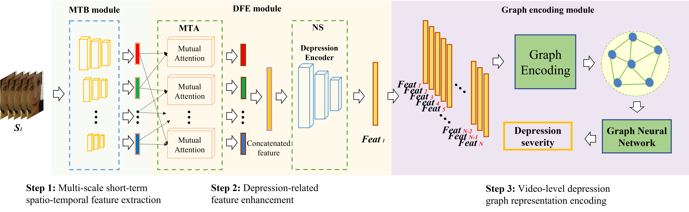

  

# 基于图表示的视频抑郁识别
[English README](README.md)

## 概述
本项目是<Two-stage Temporal Modelling Framework for Video-based Depression Recognition using Graph Representation>的代码库。

该工作的核心思路是通过图神经网络来将信息进行全局整合，来实现抑郁状态的识别。 

使用的数据集合为 AVEC 2013 ，AVEC 2014以及 AVEC 2019.

-[] 添加各个数据的ref

  

下图是模型各个部分的介绍。本模型总共由三个主要模块组成。MTB 模块首先从目标视频的每个薄片中提取多个时空尺度的短期行为特征。
从目标视频的每个薄片中提取多个时空尺度的短期行为特征。然后，DFE 模块会增强每个尺度上的特征所编码的抑郁相关线索（M
然后，DFE 模块会分别增强每个尺度上的特征（MTA 子模块）所编码的抑郁相关线索，并分离串联特征中的非抑郁噪音（NS 子模块）。
最后，我们提出了一个图编码模块，将从目标视频的所有薄片中学习到的短期抑郁特征总结为一个
视频级图表示，并将其输入图神经网络（GNN），用于抑郁严重程度的估计。

## 模型介绍
### MTB 

### DFS

### MTA

### NS

### SEG & SPG

## 数据预处理

关键预处理步骤包括筛选长度为30倍数的数据，并将格式转换为`.mat`，以30个样本为一组进行组织。

## 模型训练与测试

### 训练

训练过程涉及多个模型：
- **MTB训练**：在`Model/MTB.py`中定义，通过`MTB/MTB_Fusion_Train.py`训练。
- **MTA训练**：基于`Model/MTA.py`，执行`Model/MTA_Train.py`。
- 还概述了NS训练、谱编码器和图模型训练的附加步骤，重点关注特征提取和网络训练。

### 测试

模型针对预处理的数据集进行测试，以确保在实际场景中的准确性和有效性。

## 环境配置

依赖包括`tqdm`、`dgl`和`torch`。确保安装这些库以无缝执行项目。

## 额外资源

对于有兴趣进一步探索的研究人员，模型权重和预处理特征可在[此处](链接)获取。

## 注意事项

提供遵守数据集条款和详细操作指南，以保证可复制性和道德研究实践。

## 引用与致谢

我们的方法论建立在现有研究之上，对基础工作和贡献者给予具体的引用和致谢。

